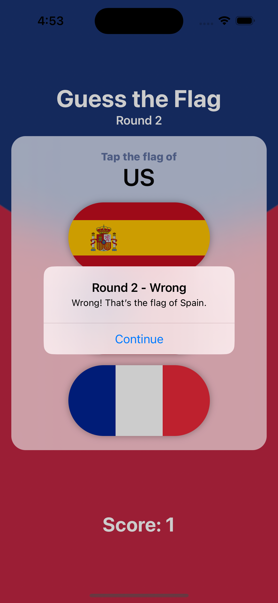

# **Project 2 - GuessTheFlag**

In this second SwiftUI project we’re going to be building a guessing game that helps users learn some of the many flags of the world.

## **Learn**

- Day 20
    - Stack
    - Color
    - LinearGradient
    - Button
    - Alert
- Day 21
    - ZStack
    - Font style
    - Font weights
    - View clipShape
- Day 22 Challenge
    1. Add an **`@State`** property to store the user’s **score**, modify it when they get an **answer** right or **wrong**, then **display** it in the **alert** and in the **score label**.
    2. When someone chooses the **wrong** flag, **tell** them their **mistake** in your alert message – something like “Wrong! That’s the flag of France,” for example.
    3. Make the game show **only** **8 questions**, at which point they see a **final alert** judging their score and can **restart** the game.
- Day 24 Challenge
    - Go back to project 2 and replace the Image view used for flags with a new FlagImage() view that renders one flag image using the specific set of modifiers we had.
```swift
struct FlagImage: View {
    var flagName: String

    init(_ flagName: String) {
        self.flagName = flagName
    }

    var body: some View {
        Image(flagName)
            .renderingMode(.original)
            .clipShape(Capsule())
            .shadow(radius: 5)
    }
}

Button {
    flagTapped(number)
} label: {
    FlagImage(countries[number])
}
```

- Day 34 Challenge
    1. When you tap a flag, make it spin around 360 degrees on the Y axis.
    2. Make the other two buttons fade out to 25% opacity.
    3. Add a third effect of your choosing to the two flags the user didn’t choose – maybe make them scale down? Or flip in a different direction? Experiment! (change **blur**)


## **My Note**

- [Day 20](https://hsiangdev.notion.site/Day-20-Project-2-part-1-100DaysOfSwiftUI-46b35e0d906c4346a55b400ac98ac650?pvs=4)
- [Day 21](https://hsiangdev.notion.site/Day-21-Project-2-part-2-100DaysOfSwiftUI-4eaeee1d01254f54b5dc3312299a57ad?pvs=4)
- [Day 22](https://hsiangdev.notion.site/Day-22-Project-2-part-3-100DaysOfSwiftUI-8c5e0e5df37645b5aa9af1cf43d8b8a8?pvs=4)
- [Day 34](https://hsiangdev.notion.site/Day-34-Project-6-part-3-Challenge-100DaysOfSwiftUI-f8efda13e99a4b10b71e4d770b826f96?pvs=4)

## Screenshots

- Day 21
<div>
  
</div>

- Day 22

<div>
  
  
  
  
</div>

- Day 34

<div>
  
  
</div>

