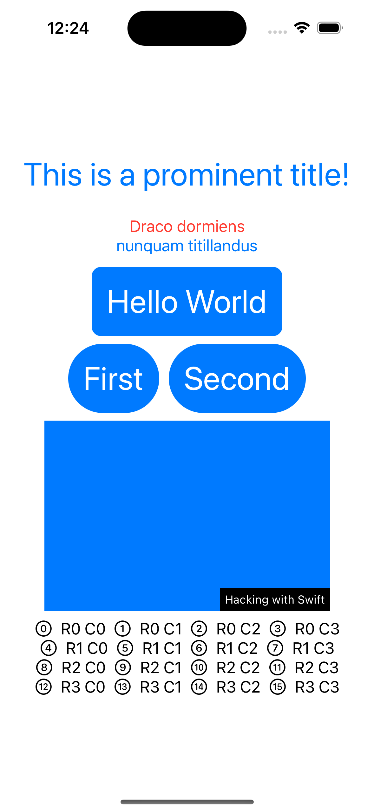

# **Project 3 - [ViewsAndModifiers](https://www.hackingwithswift.com/100/swiftui/23)**

10 topics to work through, in which you’ll learn to build custom view modifiers and custom containers, as well as start to develop your understanding of how SwiftUI actually works internally.

## **Learn**

- Day 23
    - About views
    - Modifier order matters
    - Conditional modifiers
    - Environment modifiers
    - View composition
    - Custom modifiers
    - Custom containers
- Day 24
    1. Go back to project 1 and use a conditional modifier to change the total amount text view to red if the user selects a 0% tip.
    2. Go back to project 2 and replace the Image view used for flags with a new FlagImage() view that renders one flag image using the specific set of modifiers we had.
    3. Create a custom ViewModifier (and accompanying View extension) that makes a view have a large, blue font suitable for prominent titles in a view.

## **My Note**

- [Day 23](https://hsiangdev.notion.site/Day-23-Project-3-part-1-100DaysOfSwiftUI-d36cde8531674ff8a87a769a5de8fa72?pvs=4)
- [Day 24](https://hsiangdev.notion.site/Day-24-Project-3-part-2-100DaysOfSwiftUI-b59f49791c0d44f9b8420db211c33396?pvs=4)

## Screenshots

- Day 23

  

- Day 24

  

