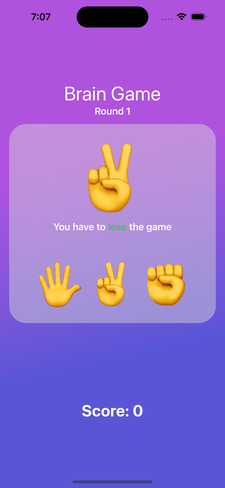
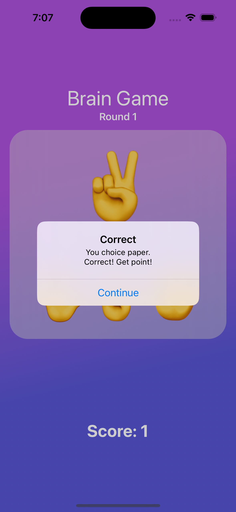
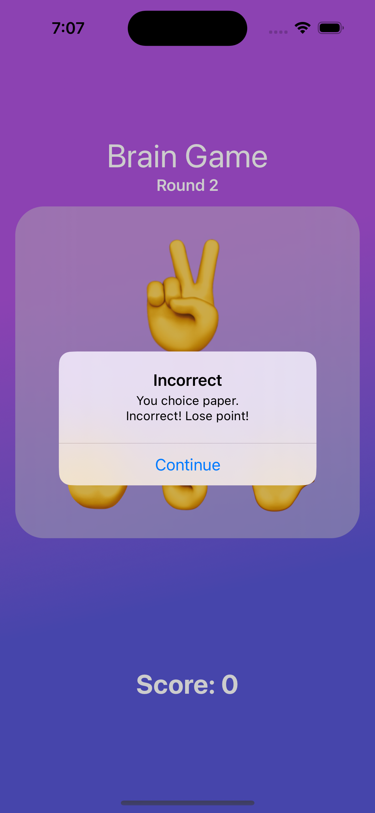
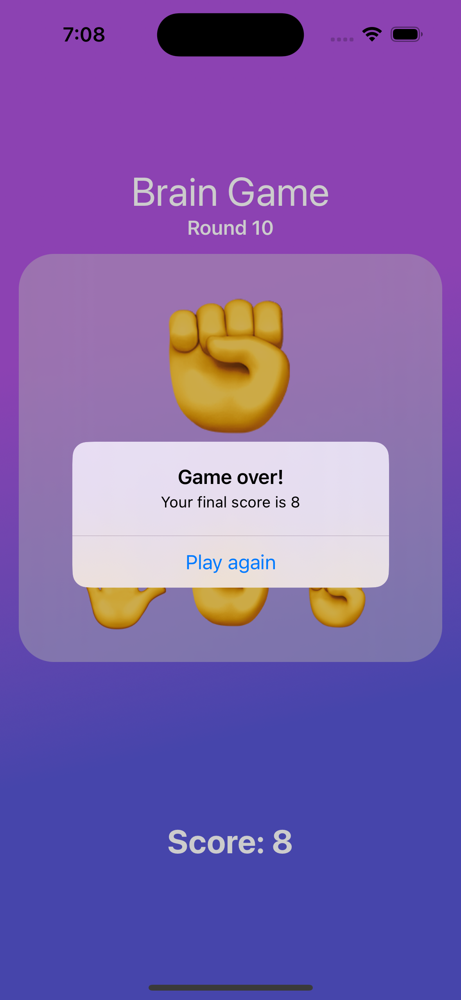

# **[Milestone Projects 1-3 & Challenge](https://www.hackingwithswift.com/100/swiftui/25)**

Today you have three topics to work through, one of which of is your challenge.

## **Learn**

- Day 25
    - Structs vs classes
    - Working with ForEach
    - Working with bindings

## **Challenge**
Make a brain training game that challenges players to win or lose at rock, paper, scissors.

So, very roughly:

- Each turn of the game the app will randomly pick either rock, paper, or scissors.
- Each turn the app will alternate between prompting the player to win or lose.
- The player must then tap the correct move to win or lose the game.
- If they are correct they score a point; otherwise they lose a point.
- The game ends after 10 questions, at which point their score is shown.

## **My Note**

- [Day 25](https://hsiangdev.notion.site/Day-25-Project-3-Milestone-100DaysOfSwiftUI-74264fd5234b4e8d9cceddb237fdb0a9?pvs=4)

## Screenshots

- Day 25

    
    
    
    

