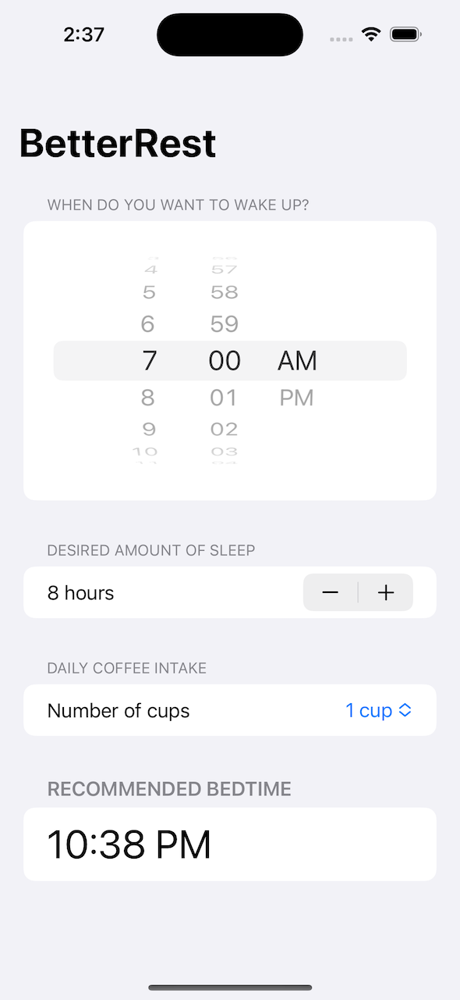

# **Project 4 - BetterRest**

- [Part 1](https://www.hackingwithswift.com/100/swiftui/26)
- [Part 2](https://www.hackingwithswift.com/100/swiftui/27)
- [Part 3](https://www.hackingwithswift.com/100/swiftui/28)

## **Learn**

- Day 26
    - Stepper
    - DatePicker
    - DateFormatter
    - Core ML
- Day 27
    - Connecting SwiftUI to Core ML
- Day 28
    1. Replace each **`VStack`** in our form with a **`Section`**, where the **text** view is the **title** of the section. Do you prefer this layout or the **`VStack`** layout? It’s your app – you choose!
    2. Replace the “Number of cups” stepper with a **`Picker`** showing the same range of values.
    3. Change the user interface so that it always shows their recommended bedtime using a nice and **large font**. You should be able to **remove** the “**Calculate**” button entirely.

## **My Note**

- [Day 26](https://hsiangdev.notion.site/Day-26-Project-4-part-1-100DaysOfSwiftUI-a91b3a99a5d842f3964dc15edc9fe59b?pvs=4)
- [Day 27](https://hsiangdev.notion.site/Day-27-Project-4-part-2-BetterRest-100DaysOfSwiftUI-e2a91ca67b9c415eb7544e45971b8e56?pvs=4)
- [Day 28](https://hsiangdev.notion.site/Day-28-Project-4-part-3-BetterRest-100DaysOfSwiftUI-c18dc43cd5104560ae792cf9edb39a9e?pvs=4)

## Screenshots

- Day 27 

    
    
    

- Day 28

    

