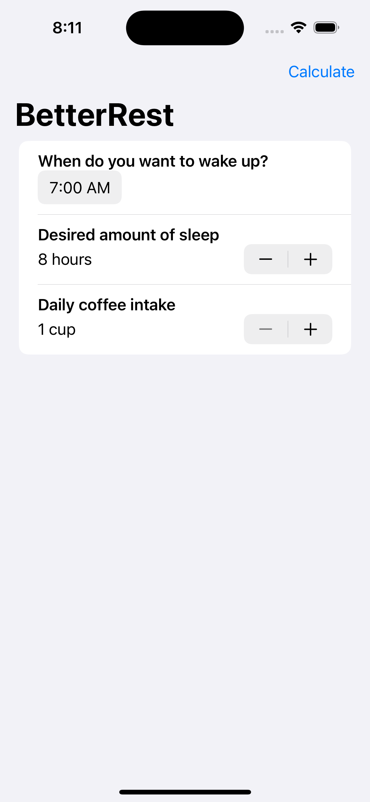
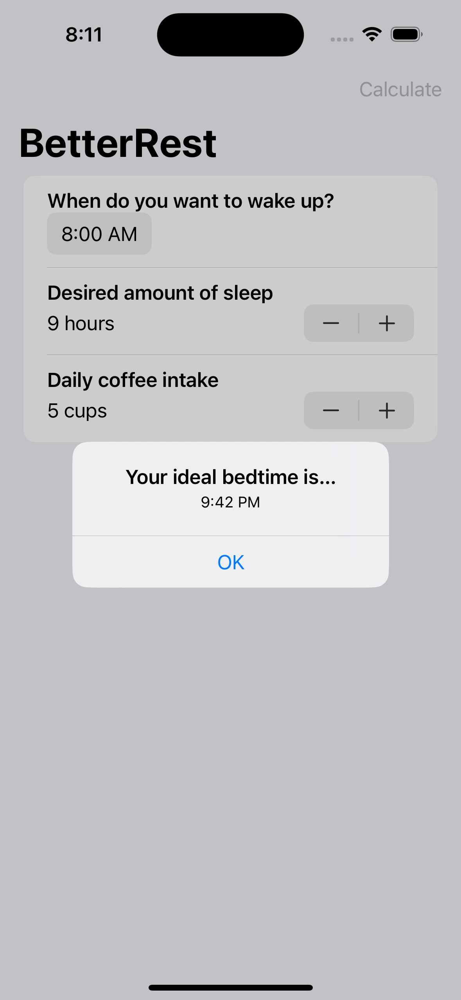

# **Project 4 - BetterRest**

- [Part 1](https://www.hackingwithswift.com/100/swiftui/26)
- [Part 2](https://www.hackingwithswift.com/100/swiftui/27)

## **Learn**

- Day 26
    - Stepper
    - DatePicker
    - DateFormatter
    - Core ML
- Day 27
    - Connecting SwiftUI to Core ML

## **My Note**

- [Day 26](https://hsiangdev.notion.site/Day-26-Project-4-part-1-100DaysOfSwiftUI-a91b3a99a5d842f3964dc15edc9fe59b?pvs=4)
- [Day 27](https://hsiangdev.notion.site/Day-27-Project-4-part-2-BetterRest-100DaysOfSwiftUI-e2a91ca67b9c415eb7544e45971b8e56?pvs=4)

## Screenshots

- Day 27 

    
    
    

