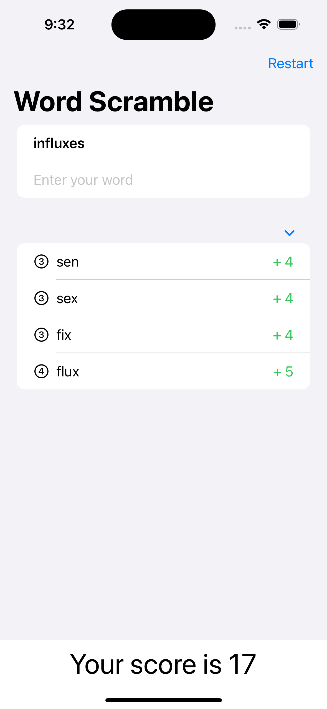

# **Project 5 - Word Scramble**

This project will be another game, although really it’s just a sneaky way for me to introduce more Swift and SwiftUI knowledge! The game will show players a random eight-letter word, and ask them to make words out of it. For example, if the starter word is “alarming” they might spell “alarm”, “ring”, “main”, and so on.

- [Part 1](https://www.hackingwithswift.com/100/swiftui/29)
- [Part 2](https://www.hackingwithswift.com/100/swiftui/30)
- [Part 3](https://www.hackingwithswift.com/100/swiftui/31)
- [Day 75: Fixing Word Scramble](https://www.hackingwithswift.com/books/ios-swiftui/fixing-word-scramble)

## **Learn**

- Day 29
    - List
    - Bundle
    - Working with strings
- Day 30
    - Symbols
    - Animation
    - fataError()
    - onAppear()
    - onSubmit()
- Day 31
    - Challenge
        - Disallow answers that are shorter than three letters or are just our start word.
        - Add a toolbar button that calls startGame(), so users can restart with a new word whenever they want to.
        - Put a text view somewhere so you can track and show the player’s score for a given root word. How you calculate score is down to you, but something involving number of words and their letter count would be reasonable.
  
- Day 75 Fixing Word Scramble
  
    By **grouping the elements** and **customizing VoiceOver labels and hints**, the Word Scramble game now provides a much more natural and coherent experience for VoiceOver users.
   
    - accessibilityElement(children: )
    - accessibilityHint()
    
    
## **My Note**

- [Day 29](https://hsiangdev.notion.site/Day-29-Project-5-part-1-WordScramble-100DaysOfSwiftUI-a6c5621103d94187a389b4230aa19c91?pvs=4)
- [Day 30](https://hsiangdev.notion.site/Day-30-Project-5-part-2-WordScramble-100DaysOfSwiftUI-38c2762a96414691834f5cb86aa34ecc?pvs=4)
- [Day 31](https://hsiangdev.notion.site/Day-31-Project-5-part-3-WordScramble-100DaysOfSwiftUI-9c5f60e24efb4ea89a1877aa4e46868a?pvs=4)
- [Day 75](https://hsiangdev.notion.site/Day-75-Project-15-Part2-Accessibility-Sandbox-100DaysOfSwiftUI-946ba1a6cc42475b91259ac48e2bd452?pvs=4#1bcd1b5bae4e4592ab7ef21c82cea30b)

## Screenshots

- Day 30

    
    
    

- Day 31

    
    
    

