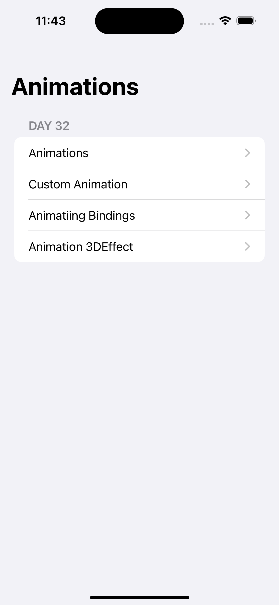
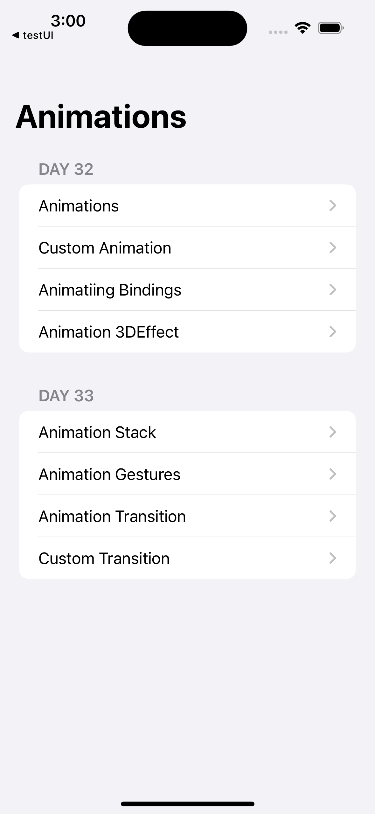
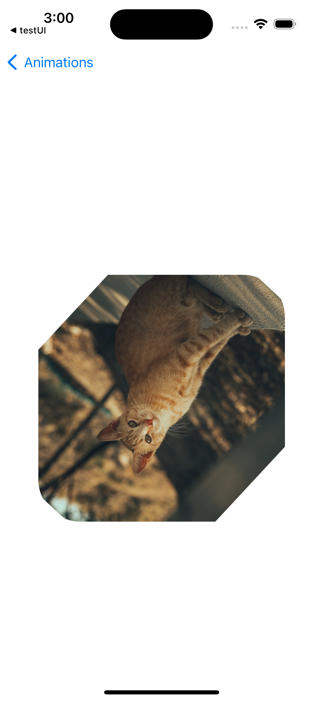
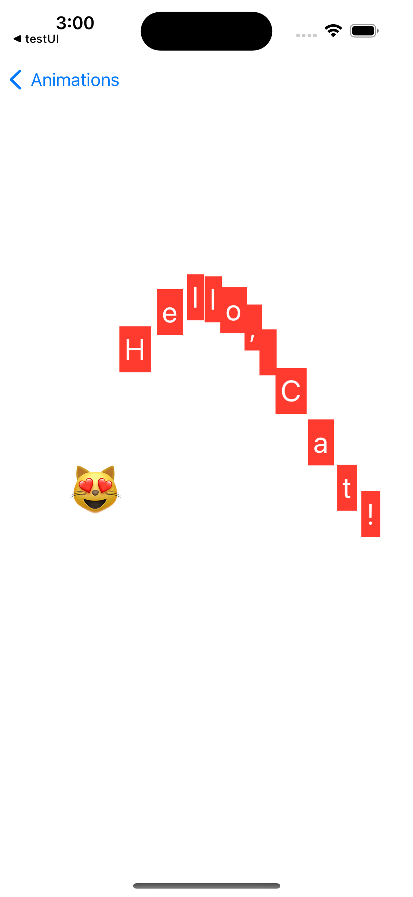
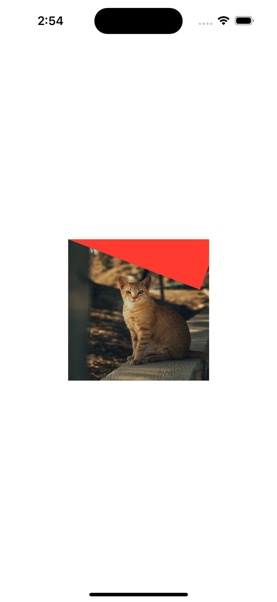
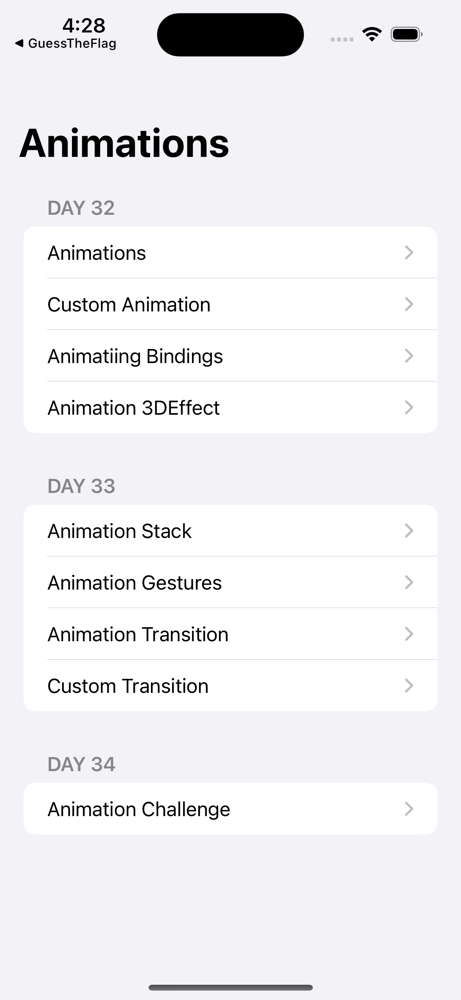
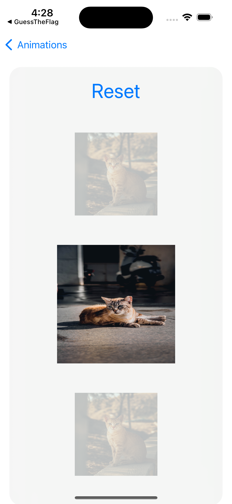

# **Project 6 - Animations**

In this technique project we’re going to look at a range of animations and transitions with SwiftUI. Some are easy – in fact, you’ll be able to get great results almost immediately! – but some require more thinking. All will be useful, though, particularly as you work to make sure your apps are attractive and help guide the user’s eyes as best as you can.

- [Part 1](https://www.hackingwithswift.com/100/swiftui/32)
- [Part 2](https://www.hackingwithswift.com/100/swiftui/33)
- [Part 3](https://www.hackingwithswift.com/100/swiftui/34)

## **Learn**

- Day 32
    - Animations
    - Custom Animations
    - Animating binding
    - Creating explicit animations
- Day 33
    - Animation stack
    - Animating gestures
    - Showing and hiding views with transitions
    - Building custom transitions using ViewModifier
- Day 34 Challenge  
Go back to the [Guess the Flag project](https://github.com/seandev0601/100DaysOfSwiftUI/tree/main/03-Project02-GuessTheFlag) and add some animation:
    1. When you tap a flag, make it spin around 360 degrees on the Y axis.
    2. Make the other two buttons fade out to 25% opacity.
    3. Add a third effect of your choosing to the two flags the user didn’t choose – maybe make them scale down? Or flip in a different direction? Experiment! (change **blur**)
    
    
## **My Note**

- [Day 32](https://hsiangdev.notion.site/Day-32-Project-6-part-1-100DaysOfSwiftUI-f1c4e03e8bd541f4802cdeda8fbd2728?pvs=4)
- [Day 33](https://hsiangdev.notion.site/Day-33-Project-6-part-2-Animations-100DaysOfSwiftUI-f29b62f4caf74423a248de51e6b14408?pvs=4)
- [Day 34](https://hsiangdev.notion.site/Day-34-Project-6-part-3-Challenge-100DaysOfSwiftUI-f8efda13e99a4b10b71e4d770b826f96?pvs=4)

## Screenshots

- Day 32

    

- Day 33

    
    
    
    

- Day 34

    
    

## Demo

- Day 32

