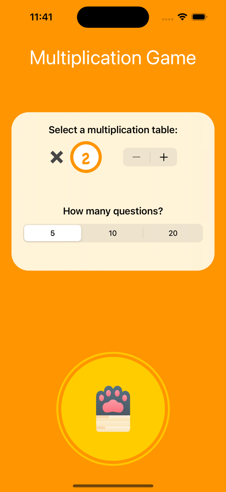
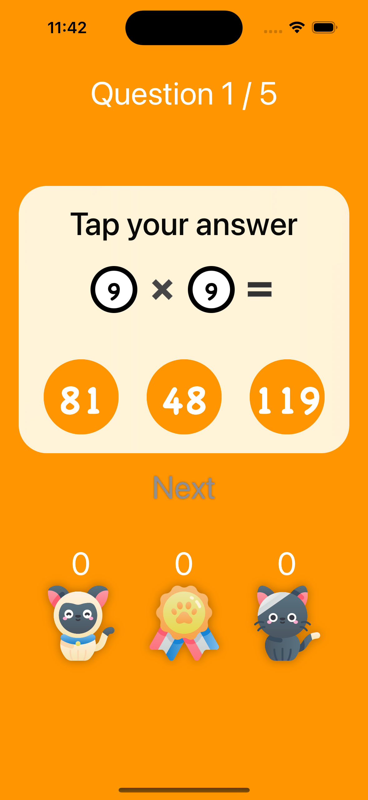
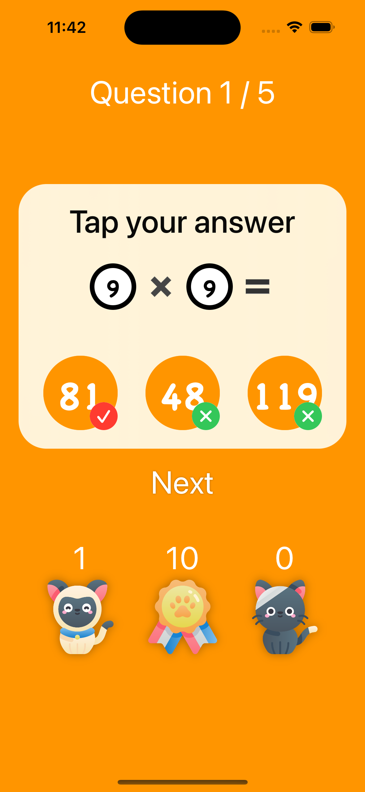
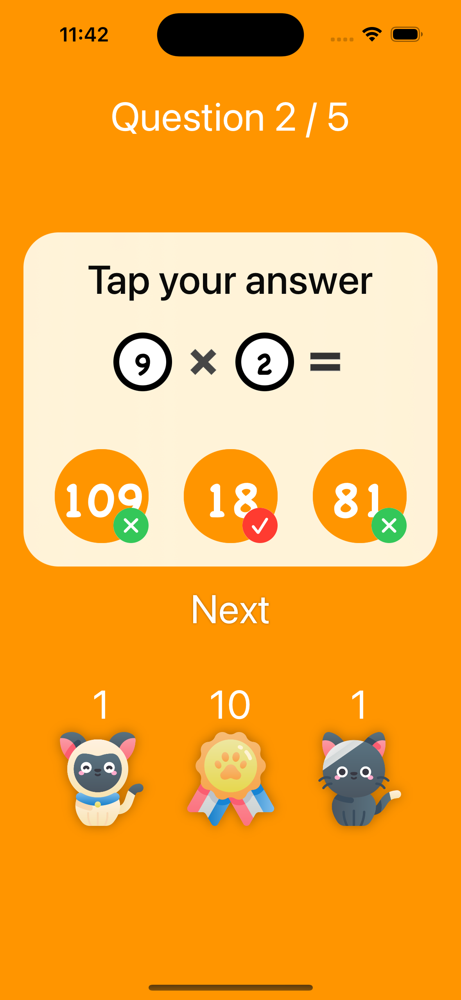

# **Milestone: Projects 4-6 & Challenge**

- [Milestone](https://www.hackingwithswift.com/100/swiftui/35)

## **Learn**

- Day 35 Challenge - MultiplicationGame  

Your goal is to build an “edutainment” app for kids to help them practice multiplication tables – “what is 7 x 8?” and so on. Edutainment apps are educational at their code, but ideally have enough playfulness about them to make kids want to play.
  
### Breaking it down:
- The player needs to **select** which **multiplication tables** they want to practice. This could be pressing **buttons**, or it could be an “Up to…” **stepper**, going **from 2 to 12.**
- The player should be able to **select** how many **questions** they want to be asked: **5, 10, or 20**.
- You should **randomly** **generate** as many **questions** as they asked for, within the difficulty range they asked for.
    
    
## **My Note**

- [Day 35](https://hsiangdev.notion.site/Day-35-Milestone-Projects-4-6-100DaysOfSwiftUI-73d705c1c7c048afa1a2bc14f924a192?pvs=4)

## Screenshots

- Day 35

    
    
    
    

## Demo

[![Watch the video]](Screenshots/day35-challenge.mp4)
