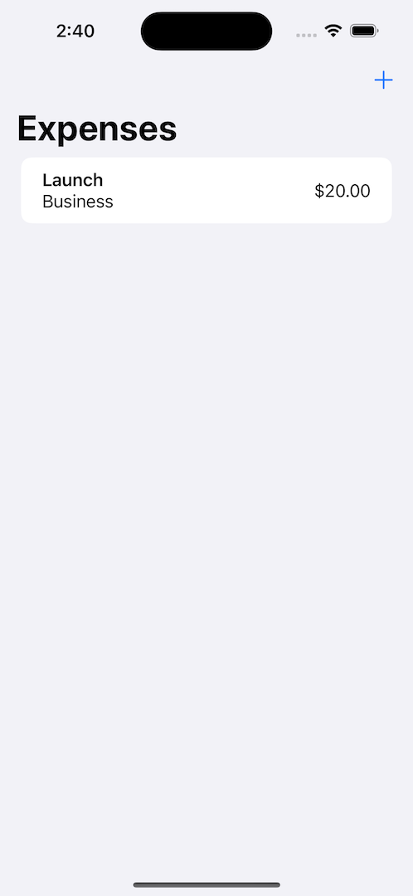
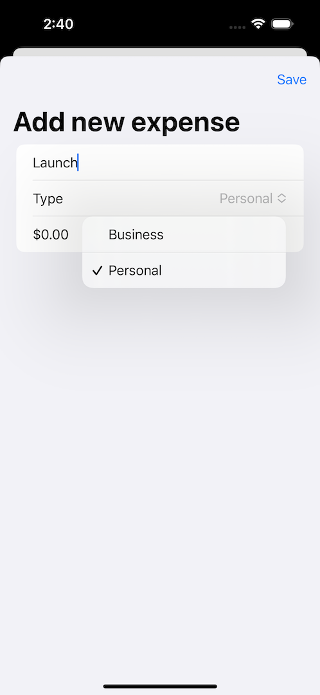

# **Project 7 - iExpense**

In this project we’re going to build iExpense, which is an expense tracker that separates personal costs from business costs. At its core this is an app with a form (how much did you spend?) and a list (here are the amounts you spent), but in order to accomplish those two things you’re going to need to learn how to:

    - Present and dismiss a second screen of data.
    - Delete rows from a list
    - Save and load user data
  
  

- [Part 1](https://www.hackingwithswift.com/100/swiftui/36)
- [Part 2](https://www.hackingwithswift.com/100/swiftui/37)

## **Learn**

- Day 36 
    - @StateObject
        - @Published
        - ObservableObject
    - Sheet
        - @Environment(.dismiss)
    - List **onDelete()**
        - EditButton
    - UserDefault
        - @AppStorage
    - Codable
        - JSONEncoder()
        - JSONDecoder()
        
- Day 37
    - @ObservableObject
    - Identifiable 、 UUID
    - JSONEncoder()
    - JSONDecoder()
    - UserDefaults
    
    
## **My Note**

- [Day 36](https://hsiangdev.notion.site/Day-36-Project-7-Part-1-iExpense-100DaysOfSwiftUI-e2b46536566f415a8af6c88dc1e49c69?pvs=4)
- [Day 37](https://hsiangdev.notion.site/Day-37-Project-7-Part-2-iExpense-100DaysOfSwiftUI-e6b60f346c6a41c4b06cbb1d1b22c334?pvs=4)

## Screenshots

- Day 37

    
    

