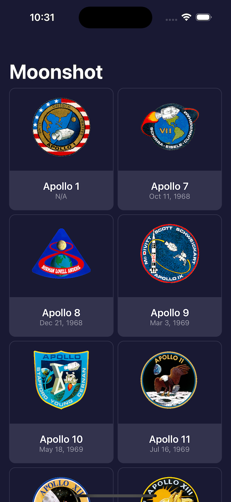
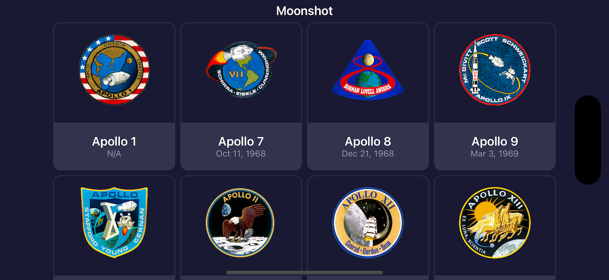
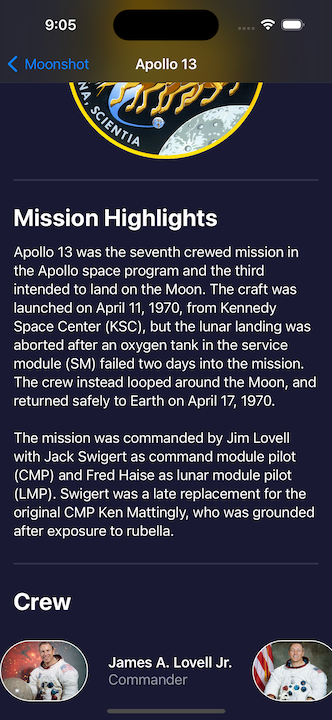
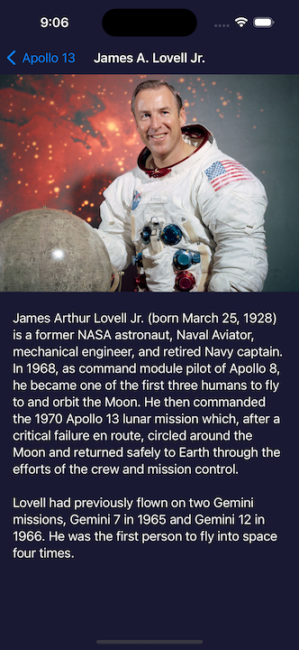
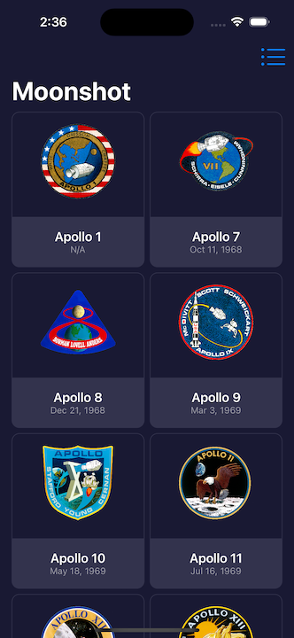
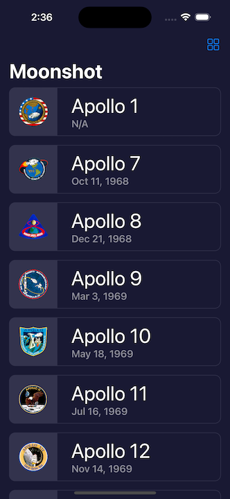
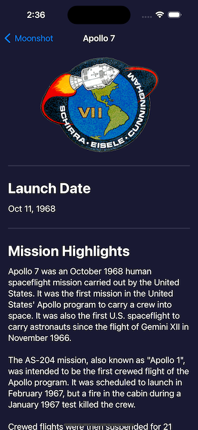

# **Project 8 - Moonshot**

- [Part 1](https://www.hackingwithswift.com/100/swiftui/39)
- [Part 2](https://www.hackingwithswift.com/100/swiftui/40)
- [Part 3](https://www.hackingwithswift.com/100/swiftui/41)
- [Part 4](https://www.hackingwithswift.com/100/swiftui/42)
- [Day 76 Implement Accessibility](https://www.hackingwithswift.com/books/ios-swiftui/accessibility-wrap-up)

## **Learn**

- Day 39
    - GeometryReader
    - ScrollView
        - LazyVStack 、   LazyHStack
    - NavigationLink
    - Decoding hierarchical JSON data
    - Scrolling grid
        - LazyVGrid 、 LazyHGrid
        - Griditem
  
- Day 40
    - extension Bundle
    - Complex Codable
    - Generic
    - DateFormatter with JSONDecoder
    - Custom Colors as ShapeStyles
    - Preferred Color Scheme  

- Day 41
    - GeometryReader
    - ScrollView
    - NavigationLink
    - Custom initializer
    - `**.navigationBarTitleDisplayMode(.inline)**`
  
- Day 42
    1. Add the launch date to MissionView, below the mission badge. You might choose to format this differently given that more space is available, but it’s down to you.
    2. Extract one or two pieces of view code into their own new SwiftUI views – the horizontal scroll view in MissionView is a great candidate, but if you followed my styling then you could also move the Rectangle dividers out too.
    3. For a tough challenge, add a toolbar item to ContentView that toggles between showing missions as a grid and as a list.
  
- Day 76 Challenge
  
    3. Do a full accessibility review of Moonshot – what changes do you need to make so that it’s fully accessible?
    
        1. ListItemView、GridItemView
            - **Read** mission **name** in **VoiceOver label** and **their date in a hint.**
                - .accessibilityElement(children: .ignore)
                - .accessibilityLabel(name)
                - .accessibilityHint(date)
        2. MissionView
            - **Hidden** mission.image
            - Add button trait for CrewMemberView
                - .accessibilityHidden(true)
                - .accessibilityAddTraits(.isButton)
            
        3. CrewMemberView
            - **Hidden** image and **combine name and role**
                - .accessibilityHidden(true)
                - .accessibilityElement(children: .combine)
            
        4. AnstronautView
            - **Hidden** anstronaut image
                - .accessibilityHidden(true)
        

    
## **My Note**

- [Day 39](https://hsiangdev.notion.site/Day-39-Project-8-Part-1-100DaysOfSwiftUI-3670328e799742e9a61397a2ff6c7670?pvs=4)
- [Day 40](https://hsiangdev.notion.site/Day-40-Project-8-Part-2-Moonshot-100DaysOfSwiftUI-8ce92c77f2ba46148dfc7aa5fb0262e8?pvs=4)
- [Day 41](https://hsiangdev.notion.site/Day-41-Project-8-Part-3-Moonshot-100DaysOfSwiftUI-cd01558d9caa4ccfb1d82cacd7284424?pvs=4)

- [Day 42](https://hsiangdev.notion.site/Day-42-Project-8-Part-4-Challenge-100DaysOfSwiftUI-39869defd4194606a79d162fc3cf605e?pvs=4)
- [Day 76](https://hsiangdev.notion.site/Day-76-Project-15-Accessibility-Sandbox-Challenge-100DaysOfSwiftUI-a7c6db79538a48b2a62d4040169b8265?pvs=4#eebedad6ccc14a16b45f8b98f7165037)

## Screenshots

- Day 40

    
    

- Day 41

    
    
    

- Day 42

    
    
    

