# **Project 9 - Drawing **

- [Part 1](https://www.hackingwithswift.com/100/swiftui/43)
- [Part 2](https://www.hackingwithswift.com/100/swiftui/44)
- [Part 3](https://www.hackingwithswift.com/100/swiftui/45)
- [Part 4](https://www.hackingwithswift.com/100/swiftui/46)

## **Learn**

- Day 43
    - Custom Paths
    - Custom Shape
        - Triangle
        - Arc
    - strokeBorder()
    - Custom InsttableShape

- Day 44
    - `CGAffineTransform`
    - `stride(from:to:by:)`
    - `Slider`
    - `FillStyle`
    - `.background()`
    - `.border()`
    - `ImagePaint`
    - `Color(hue:saturation:brightness:opacity:)`
    - `LinearGradient`
    - `drawingGroup()`
    
- Day 45
    - Blend modes
    - Dynamic blend mode
    - Combining `blur()` and `saturation()`
    - animatableData
    - `AnimatablePair`

- Day 46 Challenge
    1. Create an **`Arrow`** shape – having it point straight up is fine. This could be a **rectangle/triangle**-**style** **arrow**, or perhaps **three lines**, or maybe something else depending on what kind of arrow you want to draw.
    2. Make the line **thickness** of your **`Arrow`** shape **animatable**.
    3. Create a ColorCyclingRectangle shape that is the rectangular cousin of ColorCyclingCircle, allowing us to control the position of the gradient using one or more properties.
    - Key words:
        - InsettableShape
        - animatableData
        - LinearGradient
        - UnitPoint
    
    
## **My Note**

- [Day 43](https://hsiangdev.notion.site/Day-43-Project-9-Part-1-Drawing-100DaysOfSwiftUI-22adfcebd1654d13b004bae298d7da8e?pvs=4)
- [Day 44](https://hsiangdev.notion.site/Day-44-Project-9-Part-2-Drawing-100DaysOfSwiftUI-73efaa63e87347a6850b57d6de8e0f38?pvs=4)
- [Day 45](https://hsiangdev.notion.site/Day-45-Project-9-Part-3-Drawing-100DaysOfSwiftUI-4f58ab661ebb4cab9e79b154c58f7c8f?pvs=4)
- [Day 46](https://hsiangdev.notion.site/Day-46-Project-9-Part-4-Challenge-100DaysOfSwiftUI-d4e4c34b00f04590927c93884da40e0e?pvs=4)

## Screenshots

- Day 43

    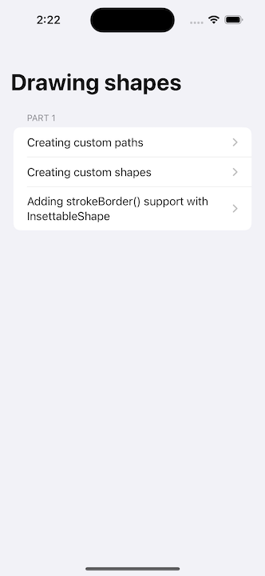
    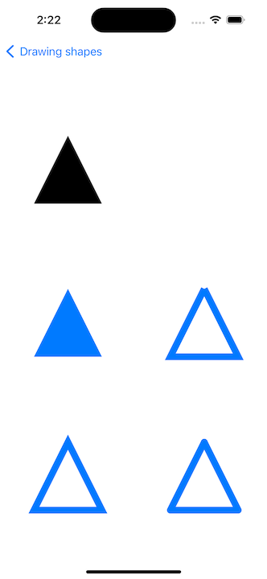
    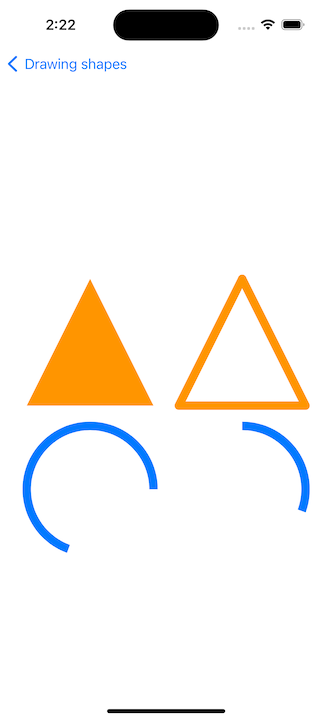
    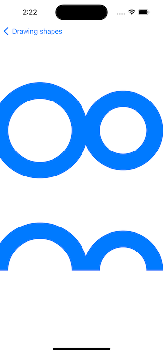

- Day 44

    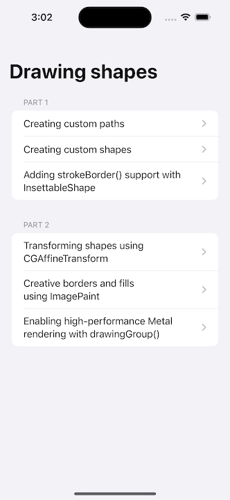
    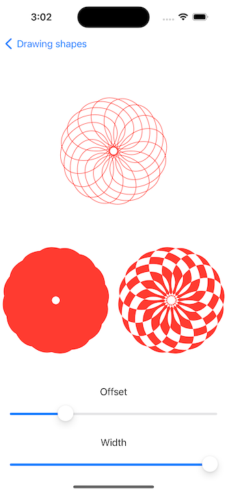
    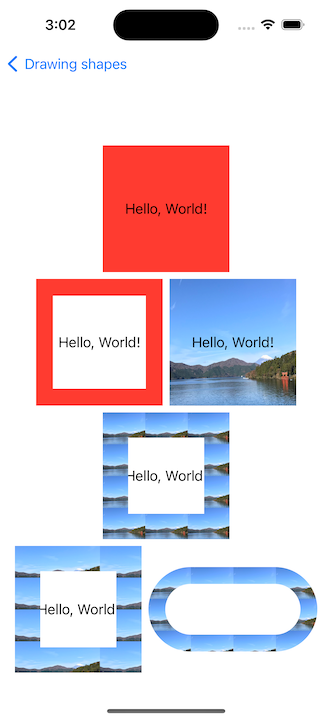
    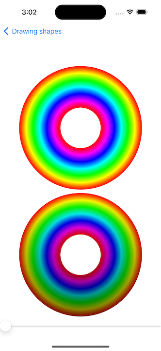

- Day 45

    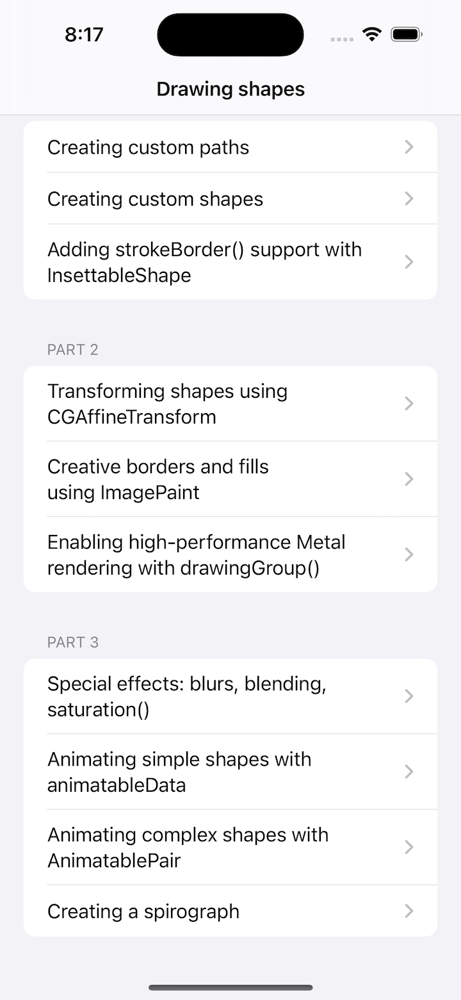
    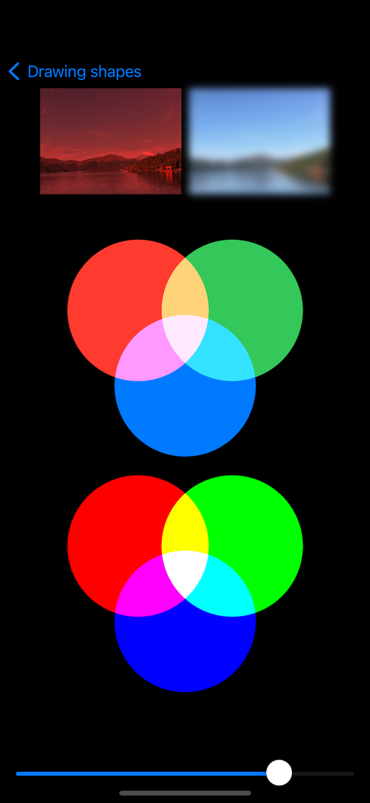
    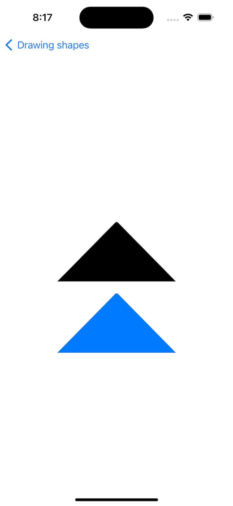
    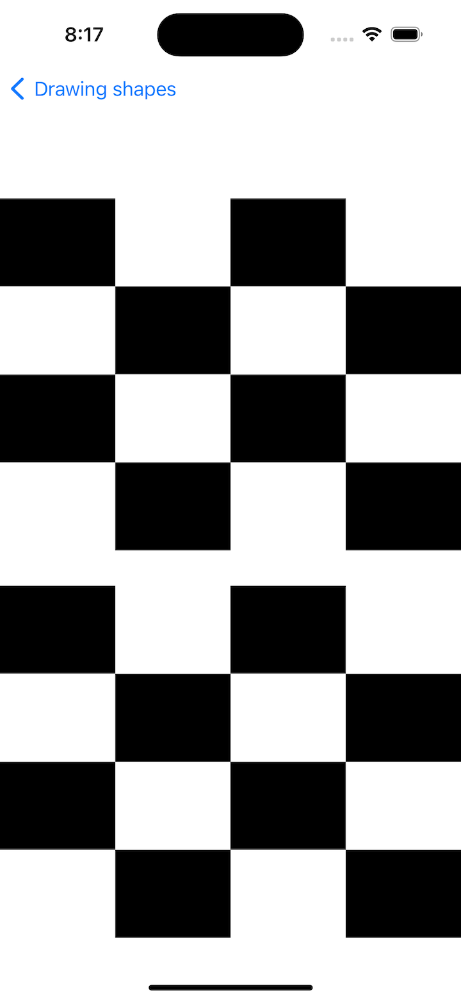
    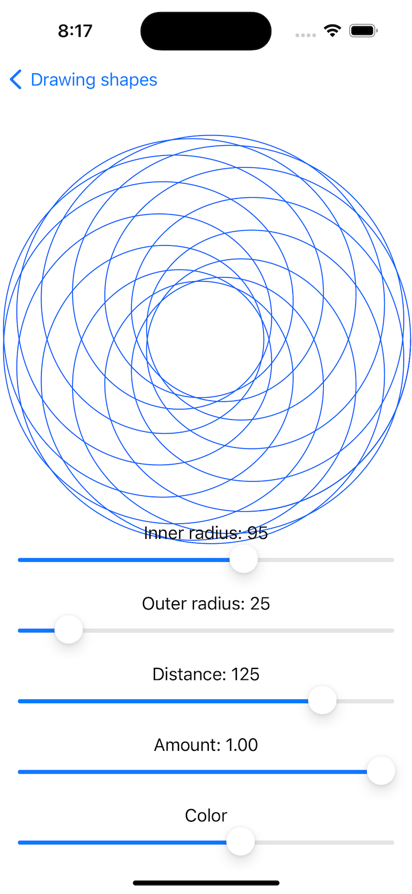

- Day 46

    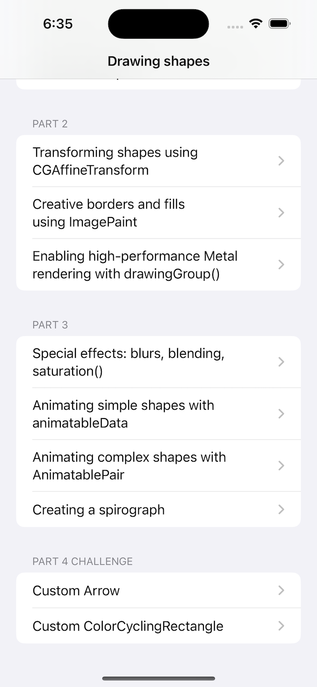
    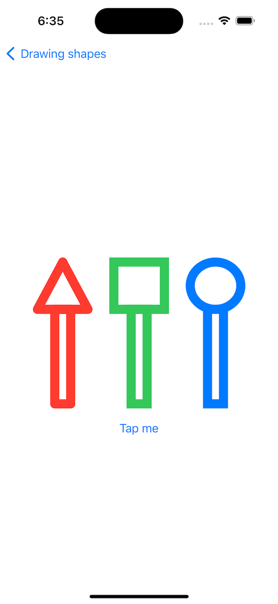
    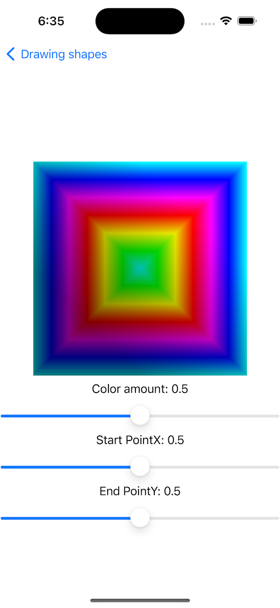

