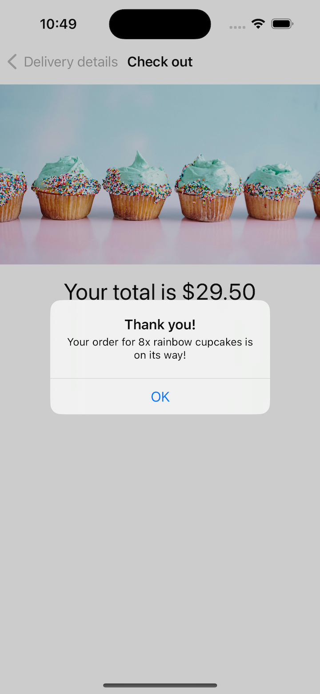

# Project 10 - CupcakeCorner

- [Part 1](https://www.hackingwithswift.com/100/swiftui/49)
- [Part 2](https://www.hackingwithswift.com/100/swiftui/50)
- [Part 3](https://www.hackingwithswift.com/100/swiftui/51)
- [Part 4](https://www.hackingwithswift.com/100/swiftui/52)
- [Day 76 Implement Accessibility](https://www.hackingwithswift.com/books/ios-swiftui/accessibility-wrap-up)

## **Learn**

- Day 49
    - Codable & @Published
    - CodingKey
    - URLSession
    - **async** and **await**
    - `task()`
    - AsyncImage
    - `disabled()`

- Day 50
    - ObservableObject
    - @StateObject
    - @ObservedObject
    - Toggle
    - **disabled()**
    - **AsyncImage**
    
- Day 51
    - **encode / decode**
    - Task
    - URLRequest
    - URLSession.shared.upload
    
- Day 52 Challenge
    1. Our address fields are currently considered valid if they contain anything, even if it’s just only whitespace. Improve the validation to make sure a string of pure whitespace is invalid.
    - trimmingCharacters(in: .whitespaces)
    
    2. If our call to placeOrder() fails – for example if there is no internet connection – show an informative alert for the user. To test this, try commenting out the request.httpMethod = "POST" line in your code, which should force the request to fail.
    - error.localizedDescription
    
    3. For a more challenging task, see if you can convert our data model from a class to a struct, then create an ObservableObject class wrapper around it that gets passed around. This will result in your class having one @Published property, which is the data struct inside it, and should make supporting Codable on the struct much easier.
    - struct : Codable
  
- Day 76 Challenge
    1. The check out view in **Cupcake Corner** uses an **image** and **loading spinner** that don’t add anything to the UI, so find a way to **make** the **screenreader** not read them out.  
    
        - Use .accessibilityHidden(true)

## **My Note**

- [Day 49](https://hsiangdev.notion.site/Day-49-Project-10-Part-1-100DaysOfSwiftUI-34a7edbc30a240ae9ae5856f7d2ce7ab?pvs=4)
- [Day 50](https://hsiangdev.notion.site/Day-50-Project-10-Part-2-CupcakeCorner-100DaysOfSwiftUI-d308b7db023f42f5bcdf719b27506f34?pvs=4)
- [Day 51](https://hsiangdev.notion.site/Day-51-Project-10-Part-3-CupcakeCorner-100DaysOfSwiftUI-9b43d50d4de045259e3f1bd56303fffe?pvs=4)

- [Day 52](https://hsiangdev.notion.site/Day-52-Project-10-Part-4-Challenge-100DaysOfSwiftUI-36f0119bce7c4d15b35728cddace913b?pvs=4)

- [Day 76](https://hsiangdev.notion.site/Day-76-Project-15-Accessibility-Sandbox-Challenge-100DaysOfSwiftUI-a7c6db79538a48b2a62d4040169b8265?pvs=4#768769cd5a1140e2ad02a081dae367c5)

## Screenshots

- Day 50

    
    
    

- Day 51

    
    

- Day 52

    

