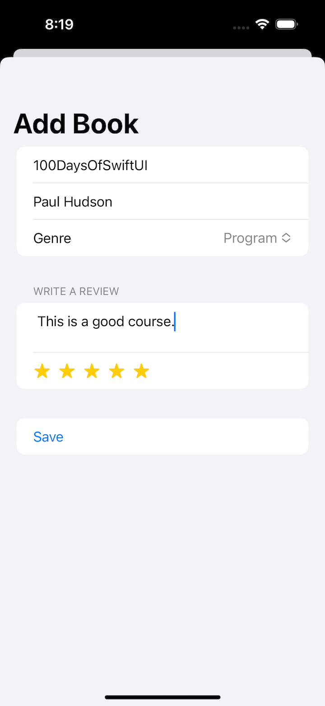
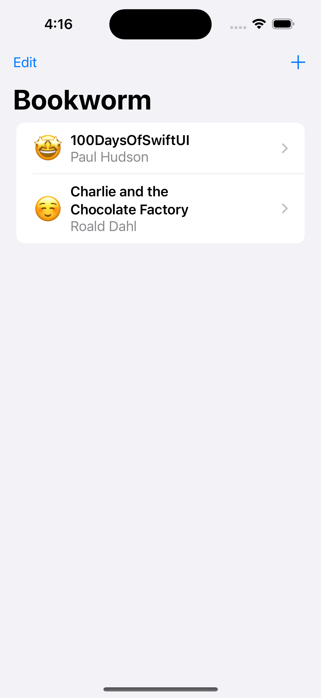
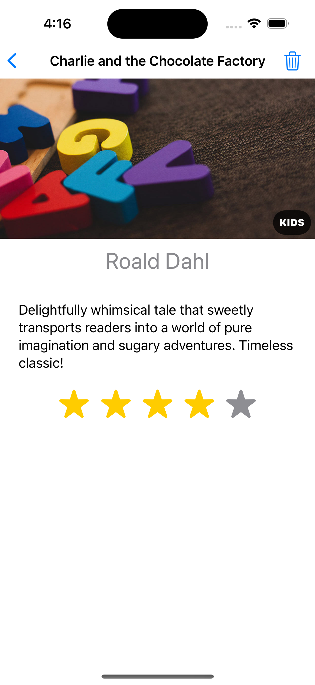
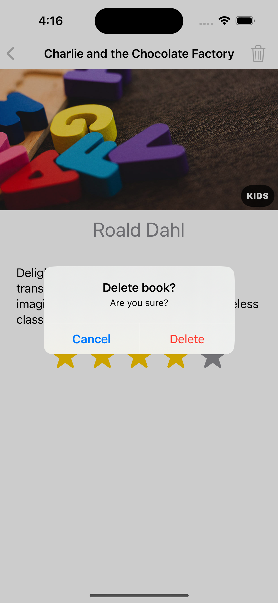
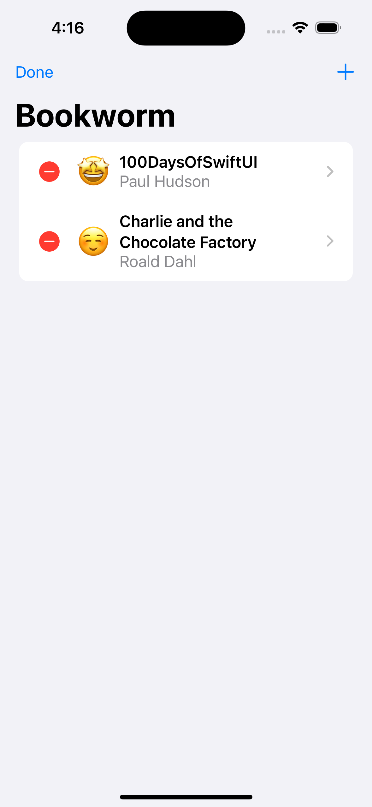
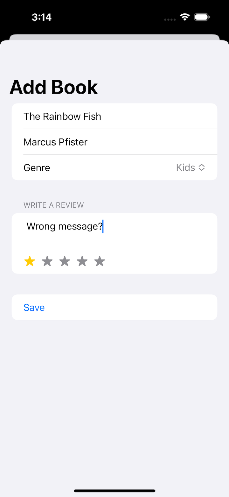
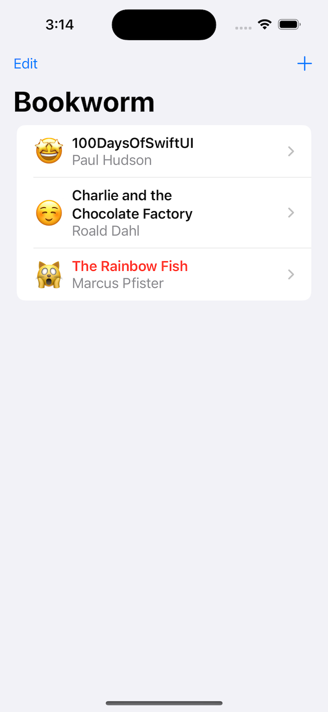
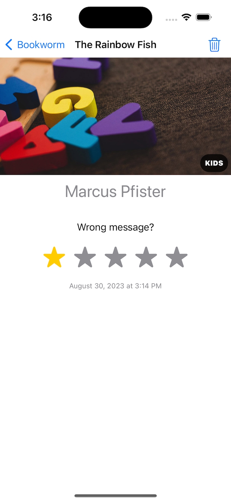

# Project 11 - Bookworm

In this project we’re going to build an app to track which books you’ve read and what you thought of them, and it’s going to follow a similar theme to project 10: let’s take all the skills you’ve already mastered, then add some bonus new skills that take them all to a new level.

- [Part 1](https://www.hackingwithswift.com/100/swiftui/53)
- [Part 2](https://www.hackingwithswift.com/100/swiftui/54)
- [Part 3](https://www.hackingwithswift.com/100/swiftui/55)
- [Part 4](https://www.hackingwithswift.com/100/swiftui/56)
- [Day 75: Fixing Bookworm](https://www.hackingwithswift.com/books/ios-swiftui/fixing-bookworm)

## **Learn**

- Day 53
    - @Binding
    - TextEditor
    - Core Data
        - entities and attributes
    - `NSPersistentContainer`
    - **Environment**
    - @FetchRequest
    - `@Environment(.managedObjectContext)`
    
- Day 54
    - Core Data - entity / attributes
    - managedObjectContext - save()
    - `sheet()`
    - @Binding
    - @FetchRequest
    - Custom RatingView & EmojiRatingView
    
- Day 55
    - ZStack(alignment: .bottomTrailing)
    - SortDescriptors
    - Core Data - delete / save
    
- Day 56 Challenge

    1. Right now it’s possible to select no title, author, or genre for books, which causes a problem for the detail view. Please fix this, either by forcing defaults, validating the form, or showing a default picture for unknown genres – you can choose.
    2. Modify **`ContentView`** so that books rated as 1 star are highlighted somehow, such as having their name shown in red.
        - other add animation to `**EmojiRatingView**`
    3. Add a new “date” attribute to the Book entity, assigning **`Date.now`** to it so it gets the current date and time, then format that nicely somewhere in **`DetailView`**.
    4. Add animation to `**RatingView**`
  
- Day 75 Fixing Bookworm
  
    > If I tap one of the gray stars, VoiceOver reads out to me, “star, fill, image, possibly airplane, star” – it’s really not useful at all.  
    
    > RatingView is designed to be reusable.
   
    - Simplified Modifiers Approach
        - accessibilityLabel()
        - accessibilityAddTraits()
    - Optimal Approach
        - accessibilityElement()
        - accessibilityLabel()
        - accessibilityValue()
        - accessibilityAdjustableAction()
    
## **My Note**

- [Day 53](https://hsiangdev.notion.site/Day-53-Project-11-Part-1-Bookworm-100DaysOfSwiftUI-9c277ffdb9934a89baac5956618f87f5?pvs=4)
- [Day 54](https://hsiangdev.notion.site/Day-54-Project-11-Part-2-Bookworm-100DaysOfSwiftUI-b6d9ea7bae814ee491101ecf08fad22c?pvs=4)
- [Day 55](https://hsiangdev.notion.site/Day-55-Project-11-Part-3-Bookworm-100DaysOfSwiftUI-0b520a58181c4ba4bd953326ef3bc95d?pvs=4)

- [Day 56](https://hsiangdev.notion.site/Day-56-Project-11-Part-4-Bookworm-100DaysOfSwiftUI-3c7ceedbbe1c4e5abe8b08fb8c50d78d?pvs=4)
- [Day 75](https://hsiangdev.notion.site/Day-75-Project-15-Part2-Accessibility-Sandbox-100DaysOfSwiftUI-946ba1a6cc42475b91259ac48e2bd452?pvs=4#0695eeaa8c774e35a8479b690cbb1dd5)

## Screenshots

- Day 54

    
    

- Day 55

    
    
    
    

- Day 56

    
    
    

