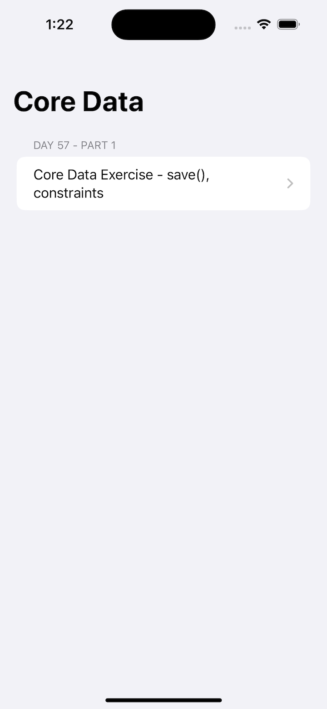
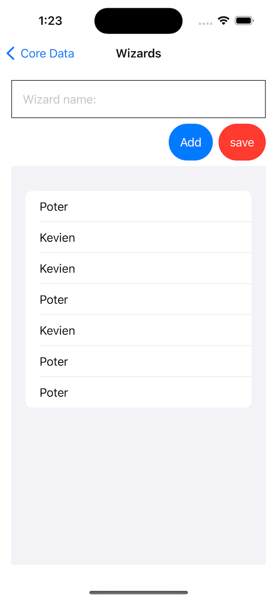
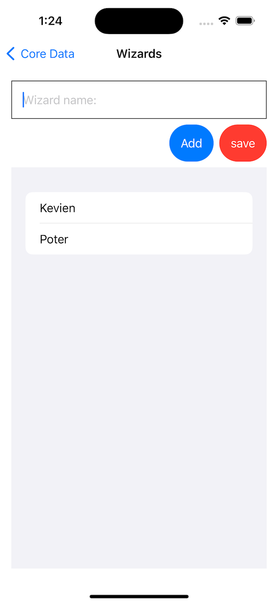
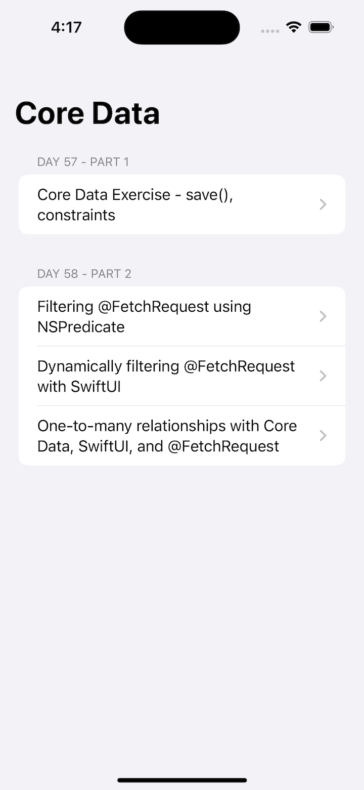
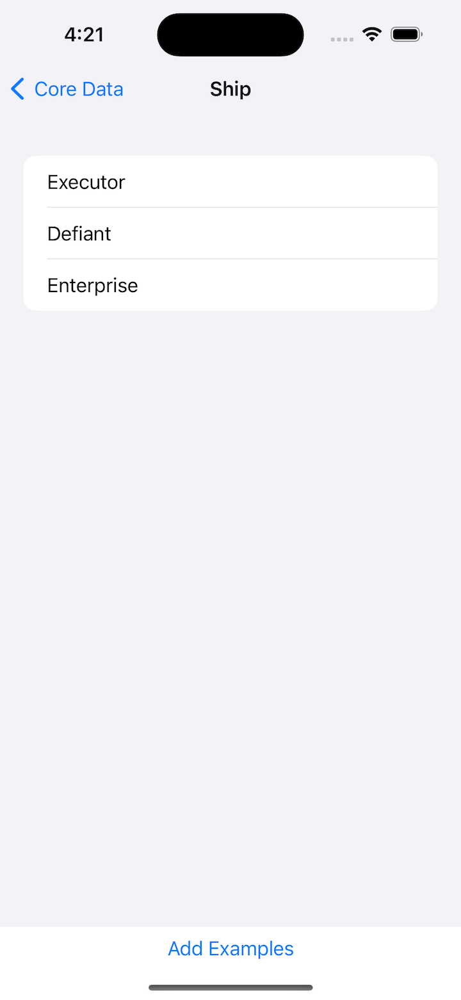
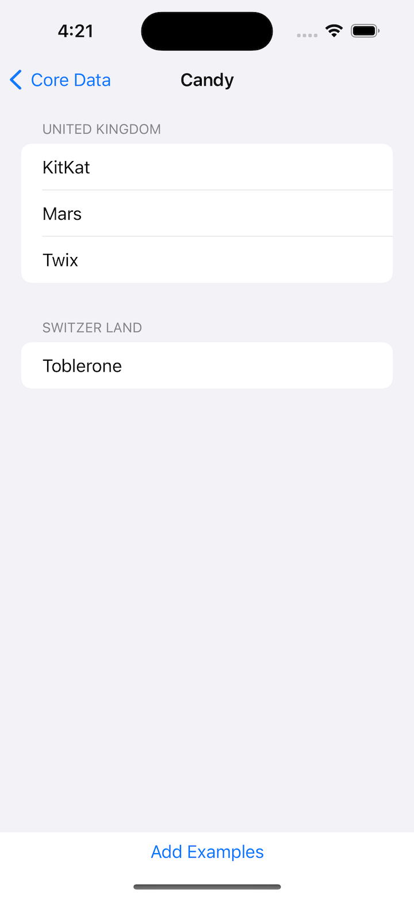

# Project 12 - CoreData

Core Data is absolutely one of those basic fundamentals – you certainly won’t use it in every project, but understanding how it works and how to make the most of it will make you a better app developer.

- [Part 1](https://www.hackingwithswift.com/100/swiftui/57)
- [Part 2](https://www.hackingwithswift.com/100/swiftui/58)

## **Learn**

- Day 57
    - ****\.self****
    - **`Identifiable`**
    - **key** **path**
    - **`Hashable`**
    - NSManagedObject subclasses
    - **`@NSManaged`**
    - **`save()` - `hasChanges`**
    - Core Data
        - ****constraints****
        - Merge Policy

- Day 58
    - @FetchRequest
        - NSPredicate
    - Dynamic Filter
        - generics
        - closure
        - @escaping
    - Core Data Relationship
    - NSSet
    
    
## **My Note**

- [Day 57](https://hsiangdev.notion.site/Day-57-Project-12-Part-1-CoreData-100DaysOfSwiftUI-a2d4eb46665a44839a471c96f28974a5?pvs=4)
- [Day 58](https://hsiangdev.notion.site/Day-58-Project-12-Part-2-CoreData-100DaysOfSwiftUI-1e51410086774f77b6e977e383073839?pvs=4)

## Screenshots

- Day 57

    
    
    

- Day 58

    
    
    
    

