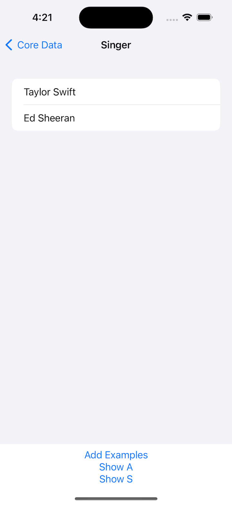

# Project 12 - CoreData

Core Data is absolutely one of those basic fundamentals – you certainly won’t use it in every project, but understanding how it works and how to make the most of it will make you a better app developer.

- [Part 1](https://www.hackingwithswift.com/100/swiftui/57)
- [Part 2](https://www.hackingwithswift.com/100/swiftui/58)
- [Part 3](https://www.hackingwithswift.com/100/swiftui/59)

## **Learn**

- Day 57
    - ****\.self****
    - **`Identifiable`**
    - **key** **path**
    - **`Hashable`**
    - NSManagedObject subclasses
    - **`@NSManaged`**
    - **`save()` - `hasChanges`**
    - Core Data
        - ****constraints****
        - Merge Policy

- Day 58
    - @FetchRequest
        - NSPredicate
    - Dynamic Filter
        - generics
        - closure
        - @escaping
    - Core Data Relationship
    - NSSet

- Day 59 - Challenge
All three of these tasks require you to modify the FilteredList view we made:

    1. Make it accept a string parameter that controls which predicate is applied. You can use Swift’s string interpolation to place this in the predicate.
    2. Modify the predicate string parameter to be an enum such as .beginsWith, then make that enum get resolved to a string inside the initializer.
    3. Make FilteredList accept an array of SortDescriptor objects to get used in its fetch request.
    
    
## **My Note**

- [Day 57](https://hsiangdev.notion.site/Day-57-Project-12-Part-1-CoreData-100DaysOfSwiftUI-a2d4eb46665a44839a471c96f28974a5?pvs=4)
- [Day 58](https://hsiangdev.notion.site/Day-58-Project-12-Part-2-CoreData-100DaysOfSwiftUI-1e51410086774f77b6e977e383073839?pvs=4)

- [Day 59](https://hsiangdev.notion.site/Day-59-Project-12-Part-3-Challenge-100DaysOfSwiftUI-1fc1c19ad1de4cc3a166f55e63f62dd9?pvs=4)

## Screenshots

- Day 57

    
    
    

- Day 58

    
    
    
    

- Day 59

    
    
    
    

