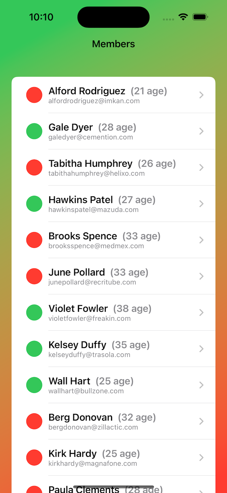
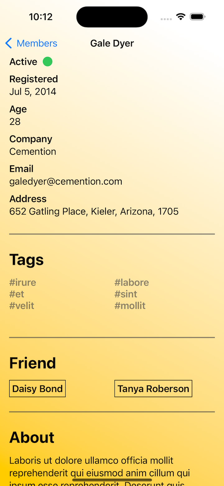
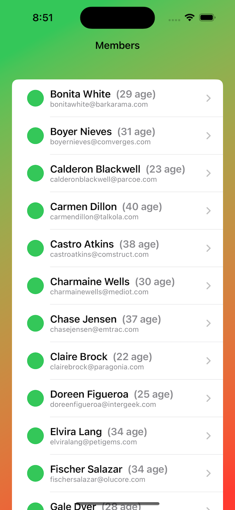
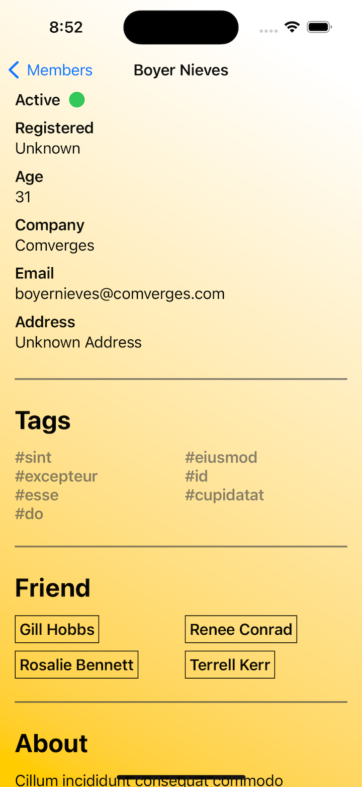

# Challenge - MemberDirectory

- [Milestone: Projects 10-12](https://www.hackingwithswift.com/100/swiftui/60)

## **Learn**

- Day 60 Milestone & Challenge
    - use **`URLSession`** to download some JSON from the internet
        - The URL you want to use is this: (https://www.hackingwithswift.com/samples/friendface.json) – that’s a massive collection of randomly generated data for example users.
    - use **`Codable`** to convert it to Swift types
    - use **`NavigationView`**, **`List`**, and more to display it to the user
## KeyWords
- Codable
- JSONDecoder
    - dateDecodingStrategy
- URLSession
    - async
    - await
- LazyVGrid
    - GridItem

----

- Day 61

Your job today is to expand your app so that it uses **Core Data**.Your boss just emailed you to say the app is great, but once the **JSON** has been **fetched** they really want it to work ***offline***.

You need to use **Core Data** to **store** the **information you download**, then use your **Core Data entities** to **display** the **views** you designed. You should **only need to fetch the data once**.

**MainActor.run**

Ensure that Core Data updates occur within the main actor to avoid UI synchronization issues.

**Tips**

1. You need to keep your original **`User`** and **`Friend`** structs, which will be used to decode the remote data.
2. When you **create Core Data entities**, give them different names such as **`CachedUser`** and **`CachedFriend`**, so they don’t conflict with your structs.
3. Add **constraints** on the **`id`** attributes for **`CachedUser`** and **`CachedFriend`**, to **avoid duplicates**.
4. You’ll need to **create** some **wrapped properties** that either return the underlying Core Data attributes if they have something in there, or sensible default values otherwise.
5. If you chose to use it, the **`tags`** attribute is an interesting challenge because it’s not something that fits into Core Data neatly. I would recommend you use something like **`user.tags.joined(separator: ",")`** to **create one string** from the array, using commas to separate the values – you can then use **`components(separatedBy:)`** later on to display them if needed.
6. When you’re creating the relationship between **`CachedUser`** and **`CachedFriend`**, don’t forget to make it work both ways by **adding an inverse relationship**.

## KeyWords

- Core Data
    - constraints
    - relationship
    - save()
    - SortDescriptor
- MainActor.run
    
## **My Note**

- [Day 60](https://hsiangdev.notion.site/Day-60-Milestone-Projects-10-12-100DaysOfSwiftUI-e2f0fba52ddc4a70a423a30f0ce3ac14?pvs=4)

- [Day 61](https://hsiangdev.notion.site/Day-61-Challenge-MemberDirectory-100DaysOfSwiftUI-9f1474a2848144d8bec1dcf61e2c442d?pvs=4)

## Screenshots

- Day 60

    
    

- Day 61

    
    

