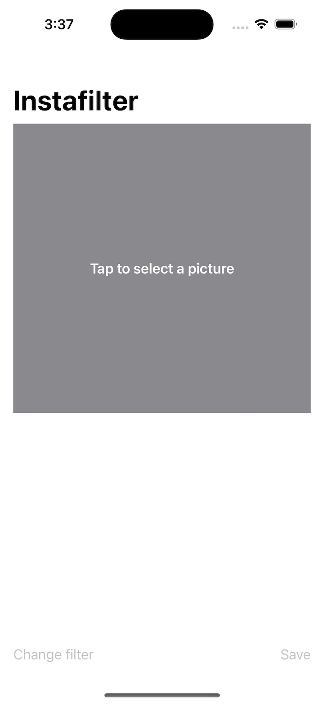
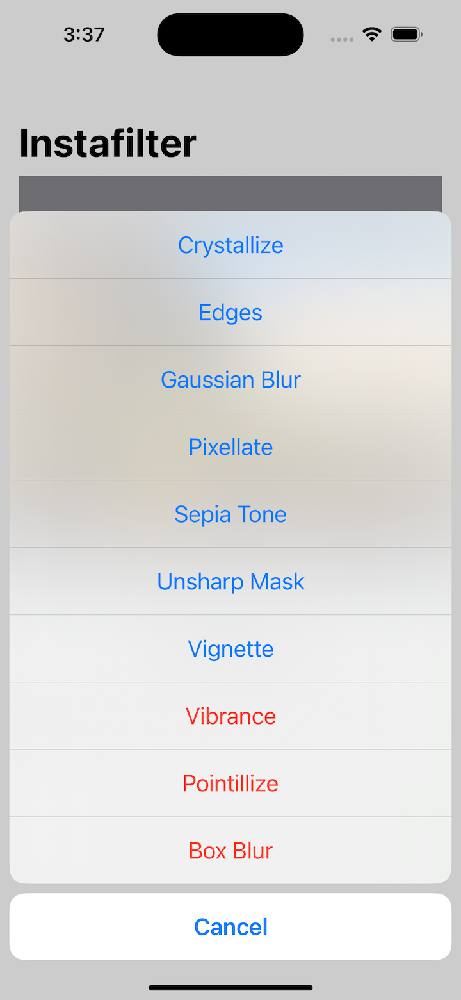
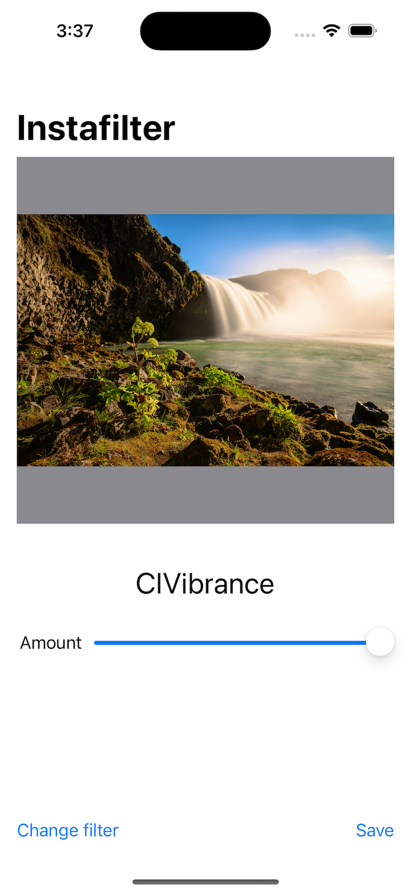
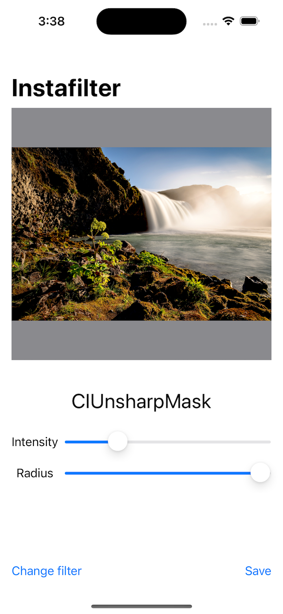

# Project 13 - Instafilter

- [Part 1](https://www.hackingwithswift.com/100/swiftui/62)
- [Part 2](https://www.hackingwithswift.com/100/swiftui/63)
- [Part 3](https://www.hackingwithswift.com/100/swiftui/64)
- [Part 4](https://www.hackingwithswift.com/100/swiftui/65)
- [Part 5](https://www.hackingwithswift.com/100/swiftui/66)
- [Part 6](https://www.hackingwithswift.com/100/swiftui/67)

## **Learn**

- Day 62 
    - @State
        - Property Observers
        - Property wrapper
    - onChange()
    - confirmationDialog()
    
- Day 63
    - Core Image
        - UIImage
        - CGImage
        - CIImage
    - CIFilter
        - Pixellation
        - Crystallize
        - Twirl Distortion
    - UIViewControllerRepresentable
    - PHPickerViewController
    
- Day 64
    - Coordinator
    - PHPickerViewControllerDelegate
    - @Binding
    - onChange()
    - UIImageWriteToSavedPhotosAlbum()
    
- Day 65
    - Basic UI
    - onTapGesture()
    - PHPickerViewController
    - onChange()
    - CIFilter.sepiaTone()
    
- Day 66
    - confirmationDialog()
    - CIFilter
        - Parameter Key
    - Closures
    
- Day 67 - Challenge
    1. Try making the Save button disabled if there is no image in the image view.
        - disabled()
    
    2. Experiment with having more than one slider, to control each of the input keys you care about. For example, you might have one for radius and one for intensity.
        - kCIInputScaleKey
        - kCIInputRadiusKey
    
    3. Explore the range of available Core Image filters, and add any three of your choosing to the app.
        - CIVibrance
            - kCIInputAmountKey
        - CIPointillize
        - CIBoxBlur
    
## **My Note**

- [Day 62](https://hsiangdev.notion.site/Day-62-Project-13-Instafilter-100DaysOfSwiftUI-378b91b6b7c44efba2695ee7399e8a8d?pvs=4)
- [Day 63](https://hsiangdev.notion.site/Day-63-Project-13-Part-2-Instafilter-100DaysOfSwiftUI-f5840a79ada3457fbfe8509778157457?pvs=4)
- [Day 64](https://hsiangdev.notion.site/Day-64-Project-13-Part-3-Instafilter-100DaysOfSwiftUI-a9acae2ae6fe4ed3a636349292218d82?pvs=4)
- [Day 65](https://hsiangdev.notion.site/Day-65-Project-13-Part-4-Instafilter-100DaysOfSwiftUI-d1b0c9345b444b358598d7d069ae24f2?pvs=4)
- [Day 66](https://hsiangdev.notion.site/Day-66-Project-13-Part-5-Instafilter-100DaysOfSwiftUI-e4a90721f5a043cd8c3cda119b4907ac?pvs=4)
- [Day 67](https://hsiangdev.notion.site/Day-67-Project-13-Part-6-Challenge-100DaysOfSwiftUI-0a3ee1fa4e5040b09bf618de0be88fa0?pvs=4)

## Screenshots

- Day 62

    
    
    

- Day 63

    
    

- Day 64

    
    

- Day 65

    
    

- Day 66

    
    
    

- Day 67

    
    
    
    

