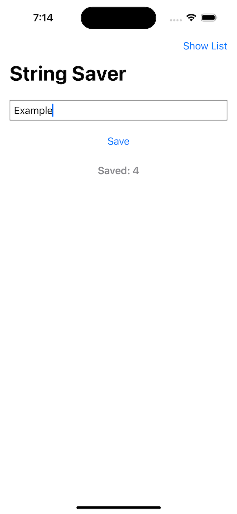
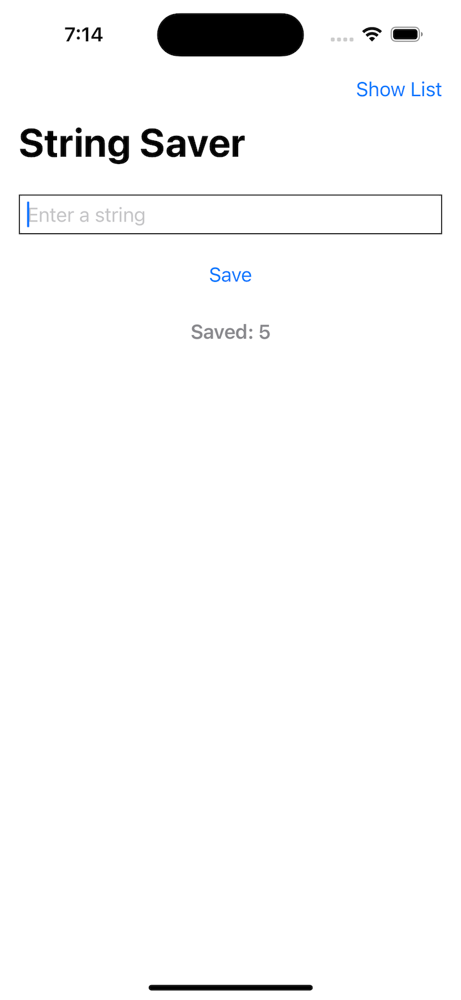
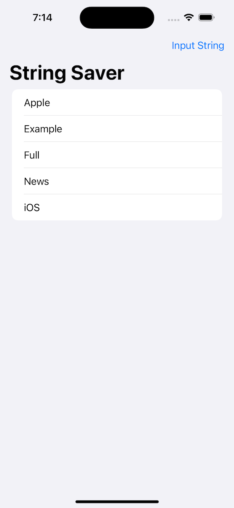
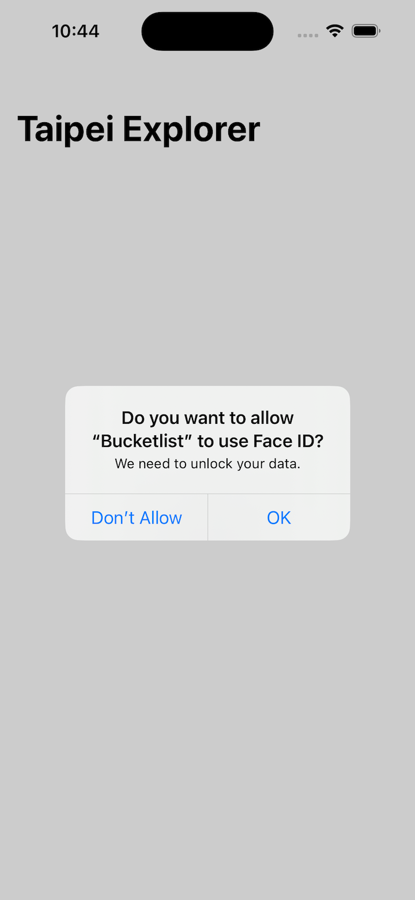
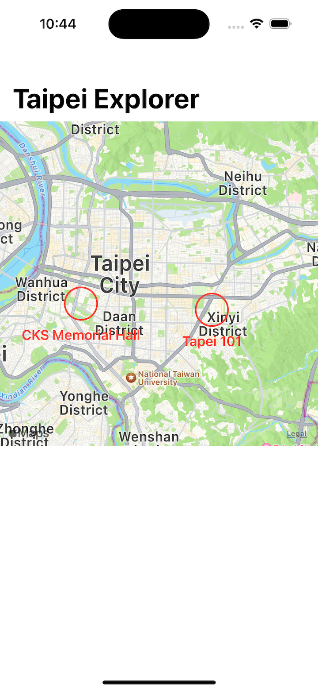

# Project 14 - Bucket List

- [Part 1](https://www.hackingwithswift.com/100/swiftui/68)
- [Part 2](https://www.hackingwithswift.com/100/swiftui/69)

## **Learn**

- Day 68 
    - Comparable for custom types
    - Documents Directory
        - FileManager
        - write(to:)
        - String(contentsOf)
    - States with Enums
  
- Day 69
    - MapKit
        - MKCoordinateRegion
        - CLLocationCoordinate2D
        - AnnotationItems
            - MapMarker
    - Face ID
        - LocalAuthentication
        - LAContext
        - EvaluatePolicy
    
## **My Note**

- [Day 68](https://hsiangdev.notion.site/Day-68-Project-14-Part-1-Bucket-List-100DaysOfSwiftUI-9e878ae63a4f4ad2a95367ff8eba166d?pvs=4)
  
- [Day 69](https://hsiangdev.notion.site/Day-69-Project-14-Part-2-Bucket-List-100DaysOfSwiftUI-b89d56a5391c45d995803a966408df62?pvs=4)

## Screenshots

- Day 68

    
    
    

  
- Day 69

    
    

