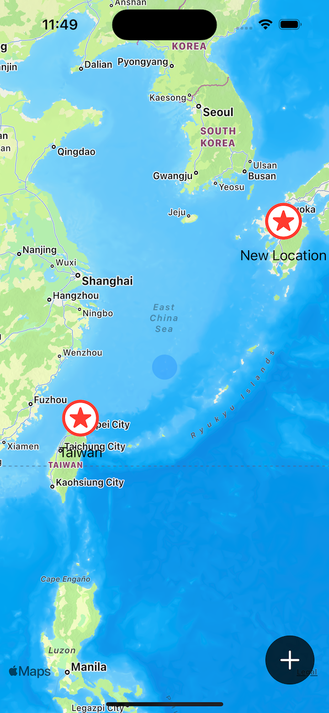
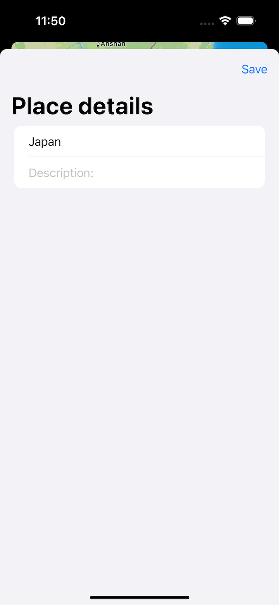
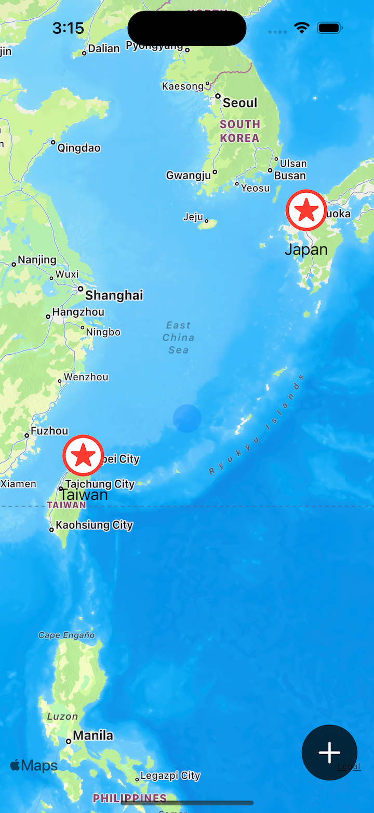
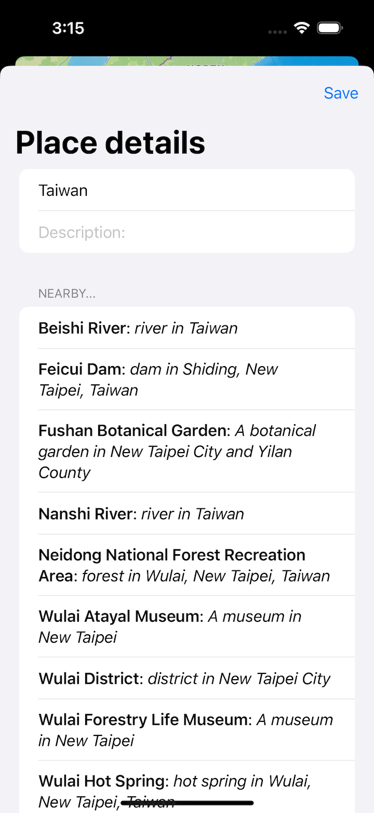
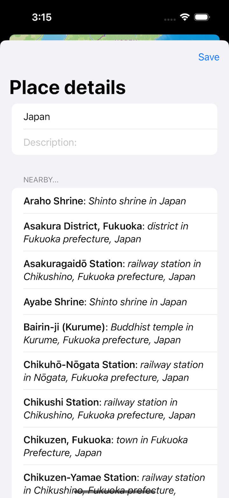
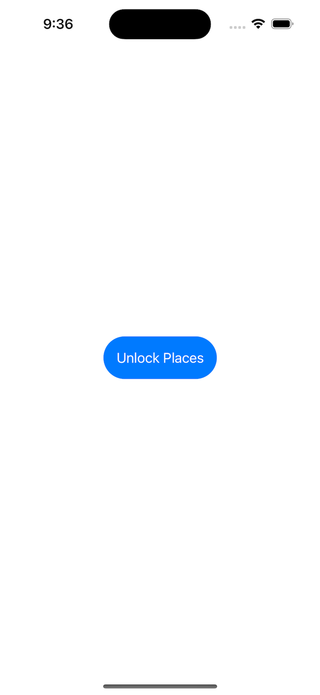
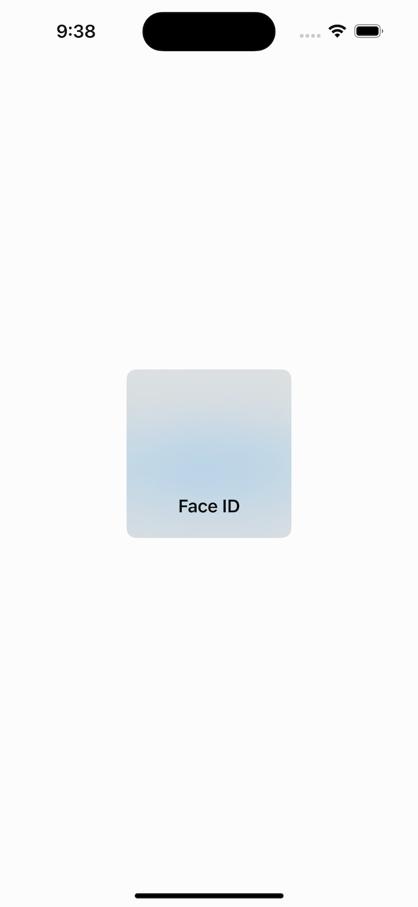
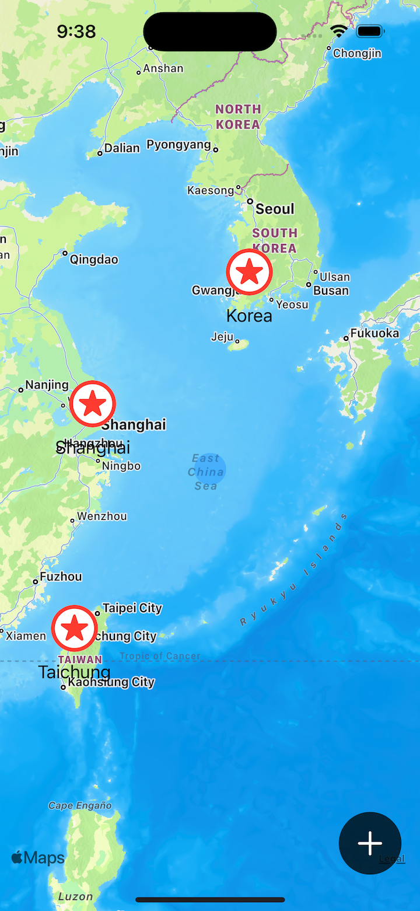

# Project 14 - Bucket List

- [Part 1](https://www.hackingwithswift.com/100/swiftui/68)
- [Part 2](https://www.hackingwithswift.com/100/swiftui/69)
- [Part 3](https://www.hackingwithswift.com/100/swiftui/70)
- [Part 4](https://www.hackingwithswift.com/100/swiftui/71)
- [Part 5](https://www.hackingwithswift.com/100/swiftui/72)

## **Learn**

- Day 68 
    - Comparable for custom types
    - Documents Directory
        - FileManager
        - write(to:)
        - String(contentsOf)
    - States with Enums
  
- Day 69
    - MapKit
        - MKCoordinateRegion
        - CLLocationCoordinate2D
        - AnnotationItems
            - MapMarker
    - Face ID
        - LocalAuthentication
        - LAContext
        - EvaluatePolicy
  
- Day 70
    - Map
    - Add Location
    - Custom map annotations
    - Annotation tap
    - Edit location
    - Use closure to update location
    - Fix clipping issues
  
- Day 71
    - Codable
    - URLSession
        - JSONDecoder
        - await、async
    - Comparable
    - Computed property
  
- Day 72
    - MVVM
        - ViewModel
        - ObservableObject
        - @MainActor
    - documentDirectory
        - load data、save data
    - LocalAuthentication
        - Permissions
        - Task & @MainActor
        - Simulator test
    
## **My Note**

- [Day 68](https://hsiangdev.notion.site/Day-68-Project-14-Part-1-Bucket-List-100DaysOfSwiftUI-9e878ae63a4f4ad2a95367ff8eba166d?pvs=4)
  
- [Day 69](https://hsiangdev.notion.site/Day-69-Project-14-Part-2-Bucket-List-100DaysOfSwiftUI-b89d56a5391c45d995803a966408df62?pvs=4)
  
- [Day 70](https://hsiangdev.notion.site/Day-70-Project-14-Part-3-Bucket-List-100DaysOfSwiftUI-a20974860d4f4fb1a83eaa17c304246a?pvs=4)
  
- [Day 71](https://hsiangdev.notion.site/Day-71-Project-14-Part-4-Bucket-List-100DaysOfSwiftUI-08b7216428a24731bebe536cd1becf05?pvs=4)
  
- [Day 72](https://hsiangdev.notion.site/Day-72-Project-14-Part-5-Bucket-List-100DaysOfSwiftUI-fc9295b1302641298447d119f721fbe0?pvs=4)

## Screenshots

- Day 68

    
    
    

  
- Day 69

    
    

  
- Day 70

    
    
    

- Day 71

    
    
    

- Day 72

    
    
    

  
