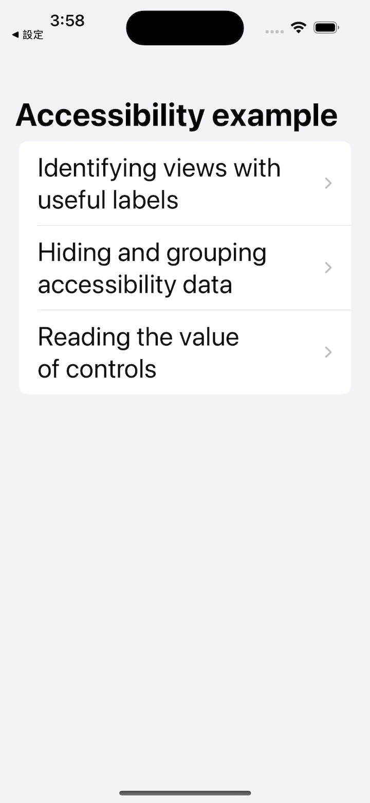
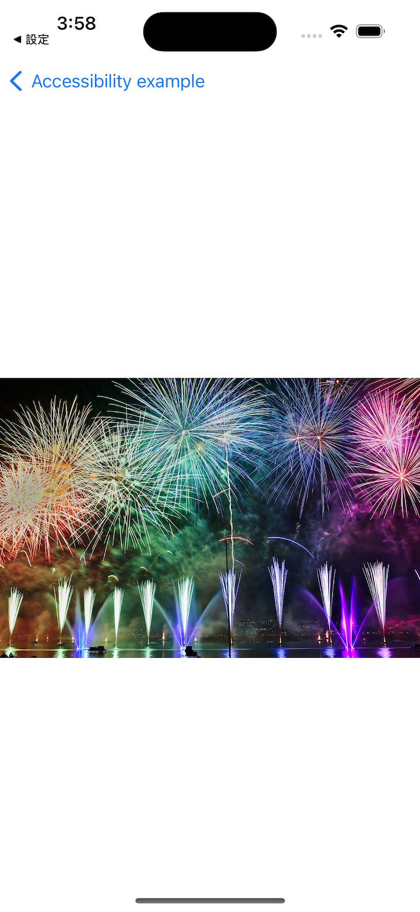
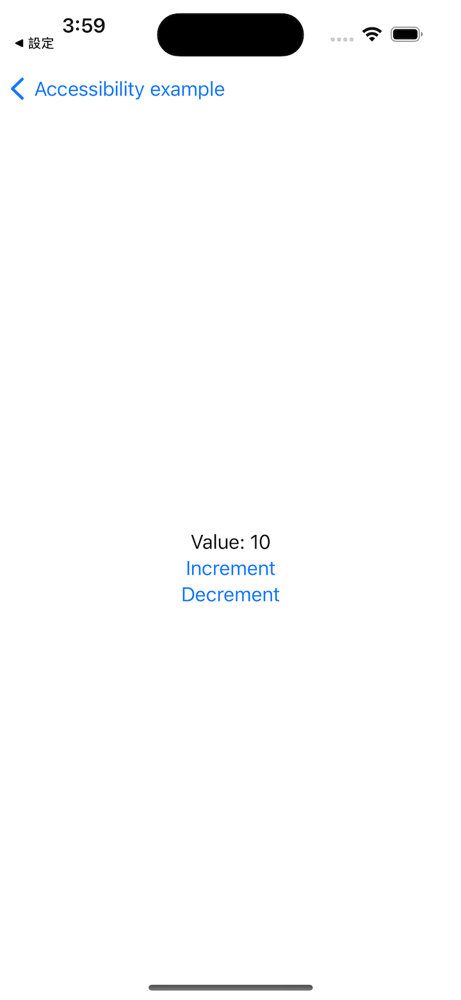

# Project 15 - Accessibility Sandbox

- [Part 1](https://www.hackingwithswift.com/100/swiftui/74)
- [Part 2](https://www.hackingwithswift.com/100/swiftui/75)

## **Learn**

- Day 74 
    - accessisbilityLabel()
    - accessibilityAddTraits()
    - accessibilityRemoveTraits()
    - Image(decorative:)
    - accessibilityHidden()
    - accessibilityElement(children:)
    - accessibilityAdjustableAction()
  
- Day 75
    - Fixing [Guess the Flag](https://github.com/seandev0601/100DaysOfSwiftUI/tree/main/03-Project02-GuessTheFlag)
        - accessibilityLabel()
    - Fixing [Word Scramble](https://github.com/seandev0601/100DaysOfSwiftUI/tree/main/07-Project05-WordScramble)
        - accessibilityElement(children:)
        - accessibilityHint()
  
    
    
## **My Note**

- [Day 74](https://hsiangdev.notion.site/Day-74-Project-15-Part-1-AccessibilitySandbox-100DaysOfSwiftUI-1b01c316c93b4aa5ab7f9a69e9e82730?pvs=4)
- [Day 75](https://hsiangdev.notion.site/Day-75-Project-15-Part2-Accessibility-Sandbox-100DaysOfSwiftUI-946ba1a6cc42475b91259ac48e2bd452?pvs=4)

## Screenshots

- Day 74

    
    
    
    

  
