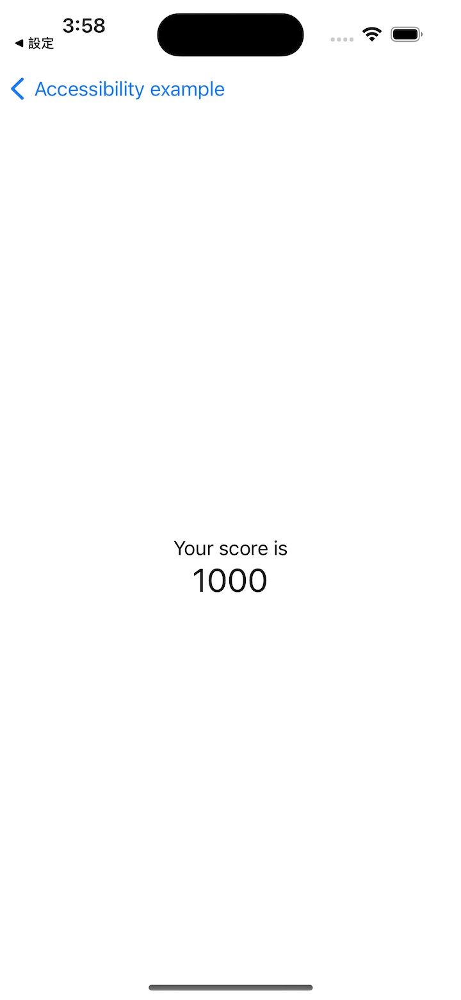

# Project 15 - Accessibility Sandbox

- [Part 1](https://www.hackingwithswift.com/100/swiftui/74)

## **Learn**

- Day 74 
    - accessisbilityLabel()
    - accessibilityAddTraits()
    - accessibilityRemoveTraits()
    - Image(decorative:)
    - accessibilityHidden()
    - accessibilityElement(children:)
    - accessibilityAdjustableAction()
    
    
## **My Note**

- [Day 74](https://hsiangdev.notion.site/Day-74-Project-15-Part-1-AccessibilitySandbox-100DaysOfSwiftUI-1b01c316c93b4aa5ab7f9a69e9e82730?pvs=4)

## Screenshots

- Day 74

    
    
    
    

  
