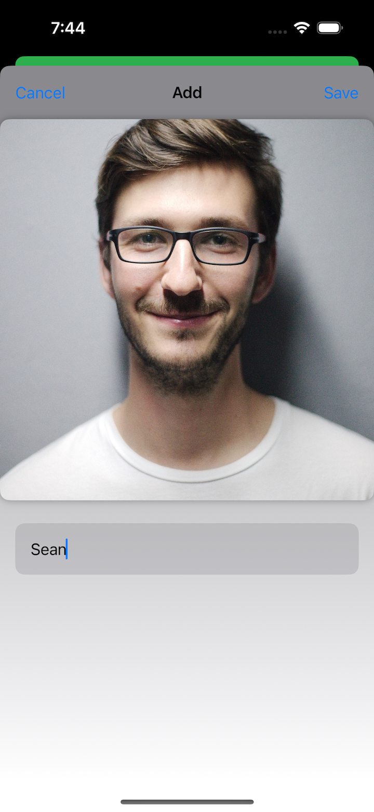
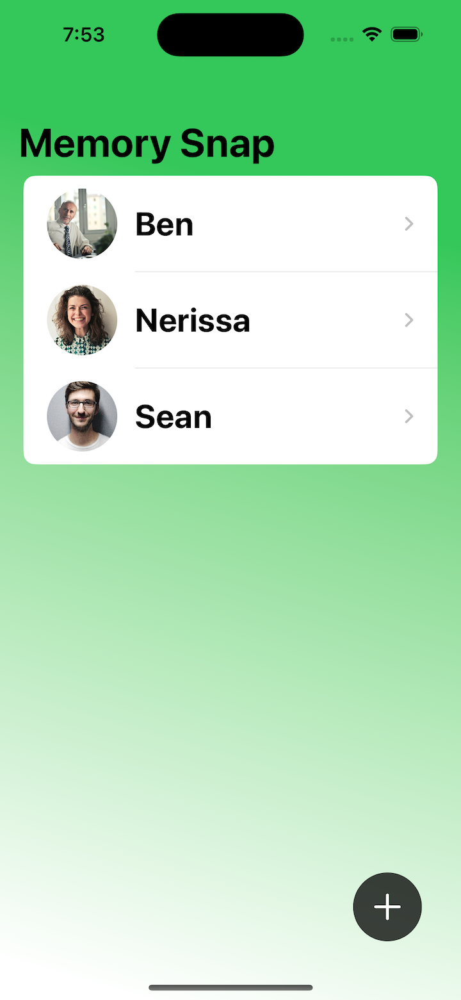
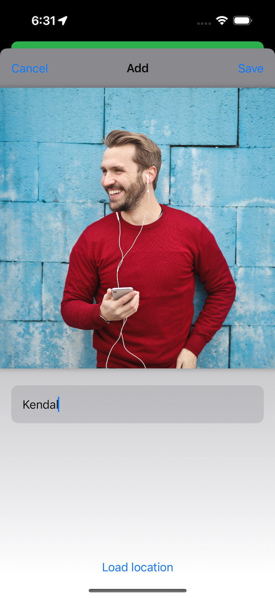
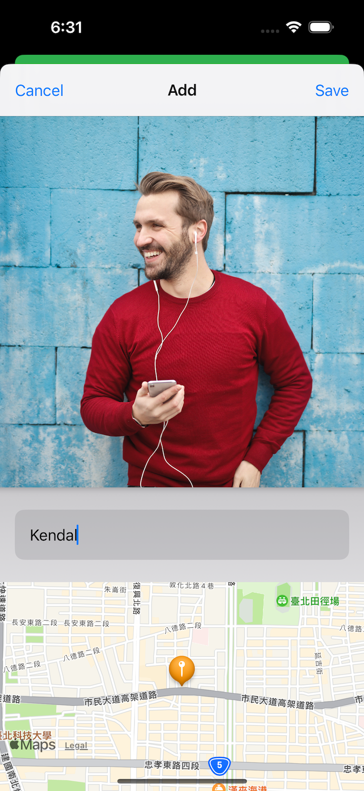
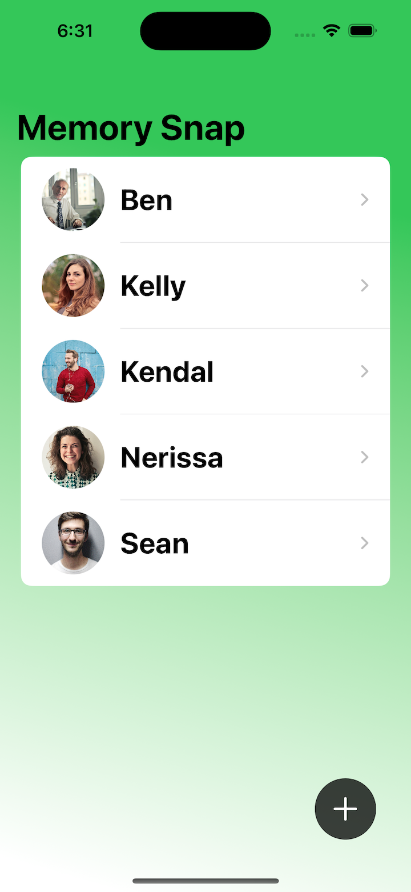
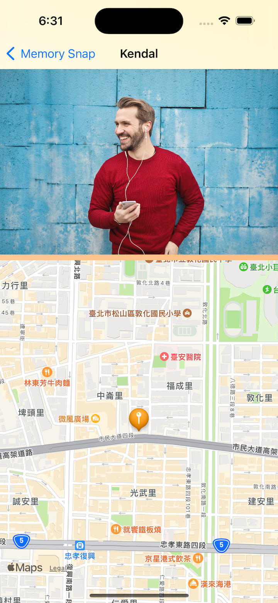

# Challenge - MemorySnap

- [Part 1](https://www.hackingwithswift.com/100/swiftui/77)
- [Part 2](https://www.hackingwithswift.com/100/swiftui/78)

## **Learn**

- Day 77 Challenge
  
Your goal is to build an app that **asks users to import a picture** **from** their **photo library**, then **attach a name** to whatever they imported. The **full collection of pictures** they **name** should be **shown** in a **`List`**, and **tapping an item** in the list should **show** a **detail screen** with a **larger version of the picture**.

Breaking it down, you should:

- Wrap **`PHPickerViewController`** so it can be used to **select photos**.
- **Detect** when a **new photo is imported**, and **immediately ask the user to name the photo**.
- **Save that name and photo** somewhere safe.
- **Show all names and photos in a list**, **sorted** by **name**.
- **Create** a **detail** screen that **shows a picture full size**. 
- **Decide** on a way to **save all this data**.

    - PHPickerViewController
    - JSONEncoder、JSONDecoder
    - documentDirectory
    - jpegData(compressionQuality:)
    - MVVM
    
- Day 78  
  
New feature: when you’re viewing a picture that was imported, you should show a map with a pin that marks where they were when that picture was added. It might be on the same screen side by side with the photo, it might be shown or hidden using a segmented control, or perhaps it’s on a different screen – it’s down to you. Regardless, you know how to drop pins, and you also know how to use the center coordinate of map views, so the only thing left to figure out is how to get the user’s location to save alongside their text and image.
    
    - CLLocationManager
    - CLLocationManagerDelegate
    - CLLocationCoordinate2D
    - Map
    
## **My Note**

- [Day 77](https://hsiangdev.notion.site/Day-77-Milestone-Projects-13-15-Challenge-MemorySnap-100DaysOfSwiftUI-984364e341b241089a768e67534019a4?pvs=4)

- [Day 78](https://hsiangdev.notion.site/Day-78-Challenge-MemorySnap-100DaysOfSwiftUI-88fa7fa7bcf34a64be02faf7bf6e5c56?pvs=4)

## Screenshots

- Day 77

    
    
    
    

- Day 78

    
    
    
    

  
