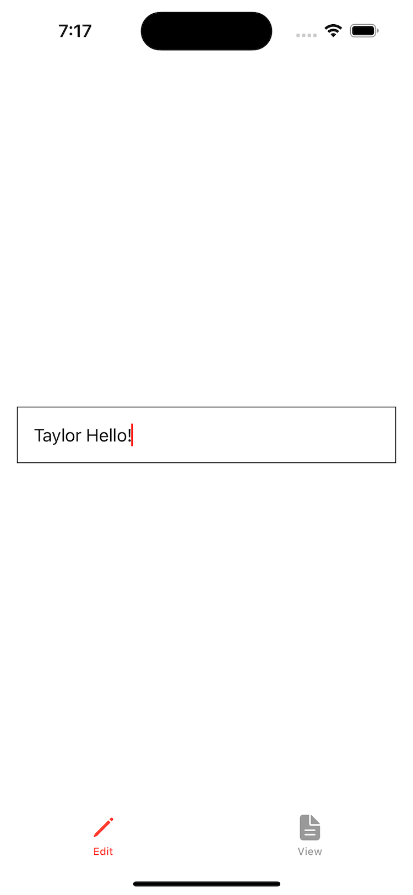
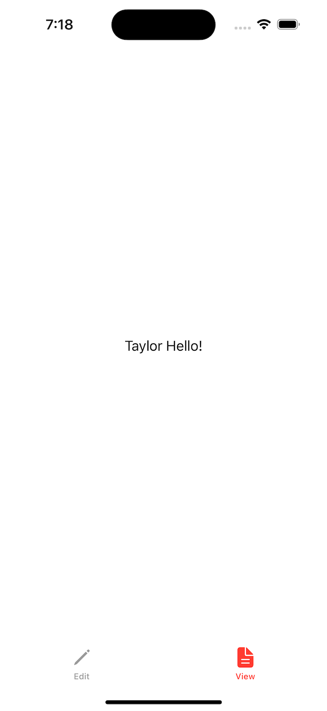

# Project 16 - Hot Prospects

- [Part 1](https://www.hackingwithswift.com/100/swiftui/79)
- [Part 2](https://www.hackingwithswift.com/100/swiftui/80)

## **Learn**

- Day 79 
  
    - @EnvironmentObject
        - environmentObject()
    - TabView
        - tabItem
        - TabView(selection:)
        - tag
        - accentColor()
        
- Day 80 
  
    - objectWillChange
    - Result<String, Error>
    - interpolation(.none)
    
## **My Note**

- [Day 79](https://hsiangdev.notion.site/Day-79-Project-16-Hot-Prospects-100DaysOfSwiftUI-6dc26b92dcd14bcc8cadb378880100cc?pvs=4)
- [Day 80](https://hsiangdev.notion.site/Day-80-Project-16-part-2-Hot-Prospects-100DaysOfSwiftUI-69aec131540b4a78be4c6f4ebc5783ac?pvs=4)

## Screenshots

- Day 79

    
    

  
