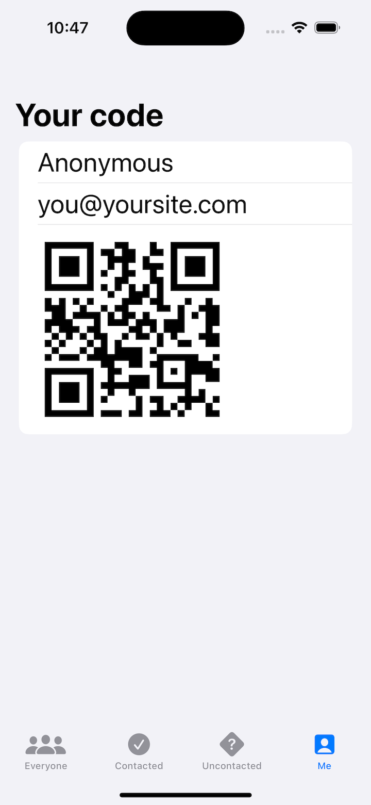
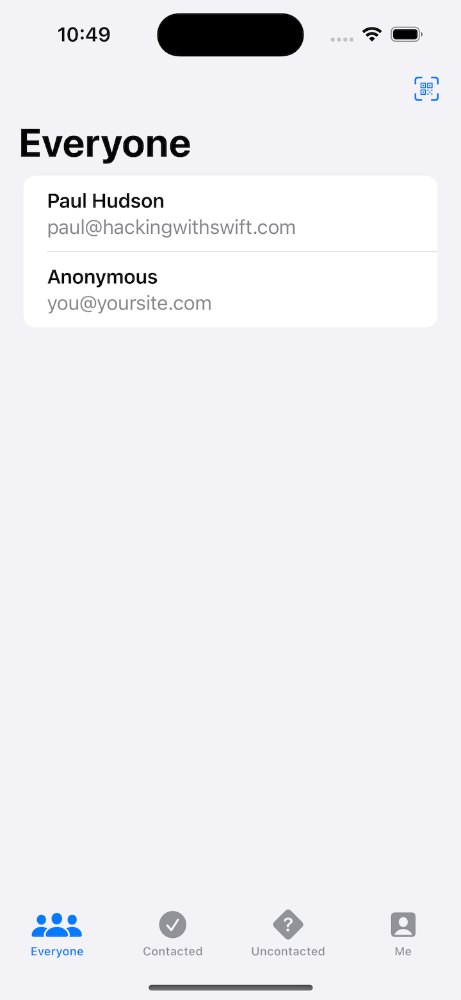
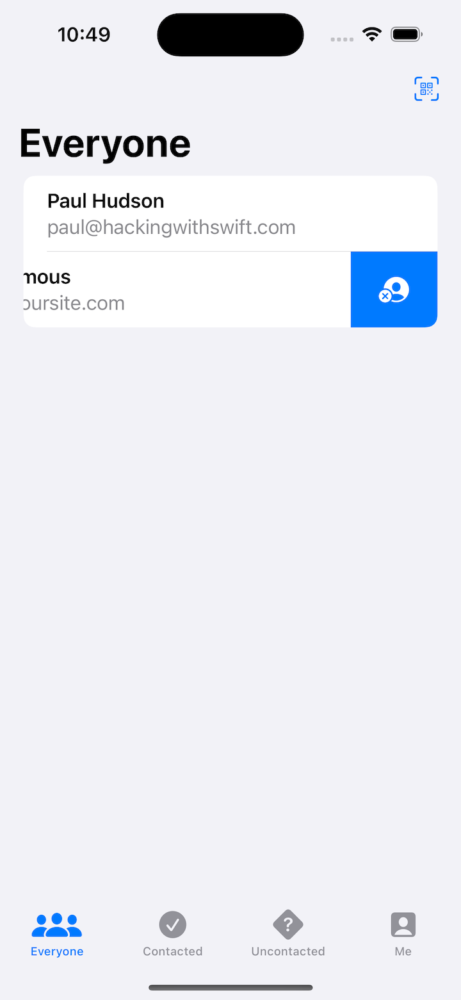

# Project 16 - Hot Prospects

- [Part 1](https://www.hackingwithswift.com/100/swiftui/79)
- [Part 2](https://www.hackingwithswift.com/100/swiftui/80)
- [Part 3](https://www.hackingwithswift.com/100/swiftui/81)
- [Part 4](https://www.hackingwithswift.com/100/swiftui/82)
- [Part 5](https://www.hackingwithswift.com/100/swiftui/83)

## **Learn**

- Day 79 
  
    - @EnvironmentObject
        - environmentObject()
    - TabView
        - tabItem
        - TabView(selection:)
        - tag
        - accentColor()
        
- Day 80 
  
    - objectWillChange
    - Result<String, Error>
    - interpolation(.none)
        
- Day 81 
  
    - contextMenu
    - swipeActions
    - UserNotifications
        - NotificationContent
        - NotificationTrigger
        - NotificationRequest
    - Swift Package Manager (SPM)
    
- Day 82

    - TabView
        - tabItem
    - @EnvironmentObject
        - ObservableObject
        - @StateObject
        - .environmentObject()
    - Computed Property
    - toolBar
    
- Day 83

    - textContentType()
    - CIFilter.qrCodeGenerator()
    - .interpolation(.none)
    - Add CodeScanner Package
    - Camera Permissions
    - Implement QR Code Scanning
    - .swipeActions
    - objectWillChange.send()
    - fileprivate(set)
    
## **My Note**

- [Day 79](https://hsiangdev.notion.site/Day-79-Project-16-Hot-Prospects-100DaysOfSwiftUI-6dc26b92dcd14bcc8cadb378880100cc?pvs=4)
- [Day 80](https://hsiangdev.notion.site/Day-80-Project-16-part-2-Hot-Prospects-100DaysOfSwiftUI-69aec131540b4a78be4c6f4ebc5783ac?pvs=4)
- [Day 81](https://hsiangdev.notion.site/Day-81-Project-16-part-3-Hot-Prospects-100DaysOfSwiftUI-46399282aa8a424482f65e048a5f3123?pvs=4)
- [Day 82](https://hsiangdev.notion.site/Day-82-Project-16-part-4-Hot-Prospects-100DaysOfSwiftUI-5a0247dd83754bab9a38cf01cac102bc?pvs=4)
- [Day 83](https://hsiangdev.notion.site/Day-83-Project-16-part-5-Hot-Prospects-100DaysOfSwiftUI-9af3a47df23c47b09ea8a8dcdb02ace8?pvs=4)

## Screenshots

- Day 79

    
    

- Day 81

    
    
    

- Day 82

    
    
    

- Day 83

    
    
    

  
