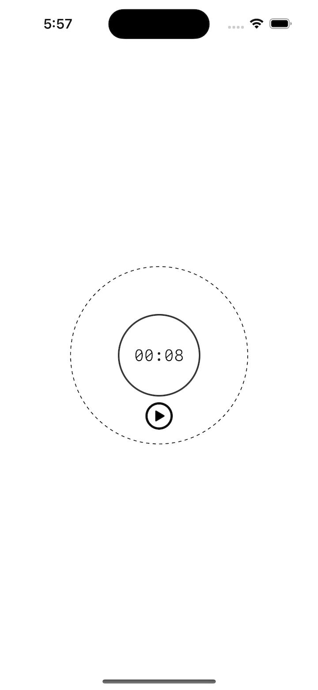

# Project 17 - Flashzilla

- [Part 1](https://www.hackingwithswift.com/100/swiftui/86)
- [Part 2](https://www.hackingwithswift.com/100/swiftui/87)
- [Part 3](https://www.hackingwithswift.com/100/swiftui/88)

## **Learn**

- Day 86
    - Gesture
        - onLongPressGesture()
        - MagnificationGesture
        - RotationGesture
        - highPriorityGesture()
        - simultaneousGesture()
        - Gesture sequences
    - Haptic effects
        - .sensoryFeedback()
            - .increase
            - .impact()
        - CoreHaptics
    - User interactivity
        - .allowsHitTesting()
        - .contentShape()
        
- Day 87
    - Time Publisher
    - ScenePhase
        - Active State
        - Inactive State
        - Background State
    - Specific accessibility
        - Differentiate Without Color
        - Reduce Motion
        - Reduce Transparency
        
- Day 88
    - Custom stacked modifier
    - Custom CardView
    - DragGesture
    - offset
    - removal closure
    
    
## **My Note**

- [Day 86](https://hsiangdev.notion.site/Day-86-Project-17-part-1-Flashzilla-100DaysOfSwiftUI-86be9502c1714968952afb5da82d79ce?pvs=4)
- [Day 87](https://hsiangdev.notion.site/Day-87-Project-17-Part-2-Flashzilla-100DaysOfSwiftUI-75d0aad922d14bbf89b9465de576fd67?pvs=4)
- [Day 88](https://hsiangdev.notion.site/Day-88-Project-17-part-3-Flashzilla-100DaysOfSwiftUI-f9d0bdf3e1ba42d4a695801aa975e20f?pvs=4)

## Screenshots

### Day 87

    
    

### Day 88

    
    
    

  
