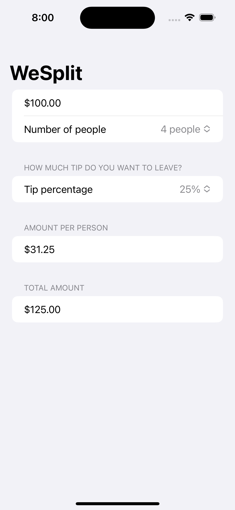

# **Project 1 - WeSplit**

In this project we’re going to be building a check-splitting app that you might use after eating at a restaurant – you enter the cost of your food, select how much of a tip you want to leave, and how many people you’re with, and it will tell you how much each person needs to pay.

## **Learn**

- Day 16
    - Form
    - Section
    - Navigation bar
    - @State
- Day 17
    - TextField
    - Picker
    - NavigationView
    - Section
- Day 18 - Challenge
    - Add a header to the third section, saying “Amount per person”
    - Add another section showing the total amount for the check – i.e., the original amount plus tip value, without dividing by the number of people.
    - Change the tip percentage picker to show a new screen rather than using a segmented control, and give it a wider range of options – everything from 0% to 100%. Tip: use the range 0..<101 for your range rather than a fixed array.
    - Make a new property to store the currency formatter.(**.currency(code: Locale.current.currencyCode ?? "USD")**)

## **My Note**

- [Day 16](https://hsiangdev.notion.site/Day-16-Project-1-part-1-100DaysOfSwiftUI-fe09504f57b342c99820c1b2f817bf45?pvs=4)
- [Day 17](https://hsiangdev.notion.site/Day-17-Project-1-part-2-100DaysOfSwiftUI-2ed5772087a64ec587dc2e6098c3e72c?pvs=4)
- [Day 18](https://hsiangdev.notion.site/Day-18-Project-1-part-3-100DaysOfSwiftUI-34cfbf80a75846afa54f592d498b71d7?pvs=4)

## Screenshots

  

